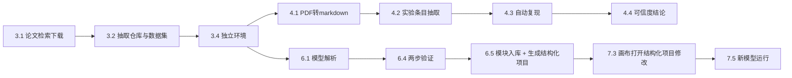
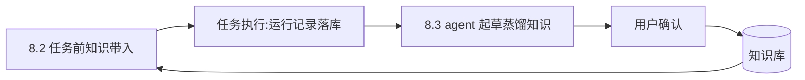

# 模块详细设计

| 项目 | 内容 |
|---|---|
| 文档版本 | v1.51 |
| 日期 | 2026-10-06 |
| 状态 | 评审通过 |
| 依据 | 《功能需求.md》《系统架构设计》《知识库与数据设计》 |
| 读者 | 开发人员、维护人员 |

| 版本 | 日期 | 修改说明 |
|---|---|---|
| v1.0 | 2026-09-26 | 初稿:基础服务设计、模块一~六详细设计、跨模块流程 |
| v1.1 | 2026-09-26 | 2.5 agent 调度改为 Claude Agent SDK 集成(Claude Code 为 agent 引擎);2.6 补充知识库 stdio MCP server 暴露 |
| v1.2 | 2026-09-26 | 2.5 模型端点收敛为 DeepSeek(官方 Anthropic 兼容端点优先)+ 网关工具调用协议翻译要求;2.5 异常与边界补充工具调用失败兜底 |
| v1.3 | 2026-09-26 | 项目类型区分(D12):2.2 原始项目/结构化项目两类工作区与类型权限;六.5 拆解生成结构化项目;七.2/七.4/七.6 画布与版本管理绑定结构化项目;九.1 流程同步 |
| v1.4 | 2026-10-01 | 阶段1 实施同步(M1 验收):三.5 明确宽限期跑通判定;二.3 明确环境创建步骤亦落 run_record;三.6 明确 nn.Module 子类兼容写法 |
| v1.5 | 2026-10-01 | 执行通道同步架构 v1.4:容器降级为可选扩展;二.3 决策树、七.1 复用清单、七.5 运行通道改为 conda/venv 子进程 |
| v1.6 | 2026-10-01 | 阶段2 实施同步(M2a 验收):五.6 新增模块三实施约定(eval 入口契约、统一 schema、alignment 结构、图表数据契约、对齐确认闸门);五.4 确认接口由 PUT 更正为 POST(对齐实现) |
| v1.7 | 2026-10-01 | 阶段2' 实施同步(M2b 验收):四.5 新增模块二实施约定(复现环境来源、复现产出口径与并行、条目确认闸门、对照阈值口径、表格 sidecar 与 `<br>` 规则、扫描版处理);二.3 环境自建补 pip 索引回退(与依赖修正循环解耦,覆盖 conda 内嵌 pip);四.5/五.6 补全链路驱动脚本(run_paper_pipeline / run_dataset_pipeline)说明 |
| v1.8 | 2026-10-02 | 阶段3 实施同步:六章补缺失章标题「## 六、模块四」;六.3/六.4 接口路径与实现口径更正(再生成引擎定为后端 Python 单一实现、验证端点收拢 `/decompose/*`);六.6 新增模块四实施约定 |
| v1.9 | 2026-10-02 | 阶段3 落地复核补正:六.6-3 补「数值比对前权重同源」约定(否则两模型各自随机初始化,比对恒不过);六.6-2 明确自定义 module 的类只实例化**直接子节点**(嵌套子模块由其自身类承载,父类不重复展开);六.6 新增 8) 结构比对口径与失败定位(层数按带参数层计、按位置对齐定位差异层)、9) saved_module_compat 内嵌 graph 的口径说明 |
| v1.10 | 2026-10-02 | 需求对齐核查(2026-10-02)同步:七.4/七.5/七.6、八.4 的未实现端点就地标注「(未实现,归阶段4/5)」,八.4 补 `/api/analysis/*` 命名冲突提示;二.1/4.2/4.4/5.2/5.3/6.5 补记 7 个「代码有、文档未列」的只读端点;五.6 同步 FASTA/PDB 基本读取与图片 RGB 归一/可选缩放(本轮补齐);六.2/七.3 补记本轮已实现的查看器展开/折叠与形状 `in → out`、后端模块库注入等实现口径。缺口登记见《开发计划》「需求对齐核查与已知缺口(2026-10-02)」 |
| v1.11 | 2026-10-02 | 缺陷清扫后的实现登记:六.6 新增 10) 边与算子判据(跨层边只允许来自直接子模块自身或其子树输出节点;单输入算子恰一条入边、二元算子至少两条、`max/min` 例外;leaf `code_hint` 为完整构造表达式且再生成引擎同样采用);二.1 补实施补充(任务取消/超时杀进程树、相同任务复用不重复入队、等 handler 收尾再推进队列) |
| v1.12 | 2026-10-02 | 三.5 补「最小可运行命令」实施补充(候选来源优先级、解释器替换规则、库型项目 import 兜底——C2 GEARS 执行暴露裸解释器问题后固化) |
| v1.13 | 2026-10-02 | 二.3 补「环境重建与解释器选择」实施补充（重建前清目录、pip 重试/读超时、解释器不按依赖挑选的已知局限、修正循环对 agent 失败容错）；六.1/六.2 补记 `PUT /api/projects/{id}/ir/input_spec` 补参通道（agent 给不出具体输入维度时的兜底，C2 GEARS 暴露） |
| v1.14 | 2026-10-02 | 六.1 补「补参自动化与拆解自检」实施补充：形状追踪顺带从实例化模型回填层构造参数（维度类以模型为准）与推导输入形状；拆解增加「试跑再生成」自检与带失败回喂的重试；记录签名对 agent 可选参数书写敏感的已知局限（C2 一键复现暴露） |
| v1.15 | 2026-10-02 | 六.6-4/5 修复「同一个模型可能算出两个编号」：形状追踪增记节点 `params_model`（模型实际构造参数，另加「只保留类构造接口真正接受的参数名」闸门），结构签名改取 AI 参数 ∪ 模型参数（模型值优先），算子节点按 `OP_PARAM_DEFAULTS` 占位符默认值补齐；形状追踪由「形状齐全即跳过」改为首次必跑一次；补参回填改按「与构造默认值不同的参数」以免平白改动 `ir_hash`；如实记录一次性编号变号。同日把这两处补记改写为中文全称、补足术语解释（内容不变） |
| v1.16 | 2026-10-02 | 正文前新增《术语对照》小节：本文用到的结构描述字段与节点类型、大模型相关字样、运行记录与索引表名、环境通道等逐条给出中文含义；正文措辞与设计口径不变 |
| v1.17 | 2026-10-03 | **阶段4 实施同步（M4/M5 验收）**：七章按实施结果修订——七.1 魔改清单按实际落地更正（模块库注入方式、traceService 基址、路由位置）；七.2 补三并列入口与画布新建结构化项目；七.3 补 params_schema 参数面板映射与已知边界；七.4 接口「未实现」更正为已实现并登记两条偏差（network_id=project_id、导出统一走后端再生成引擎）；七.5 更正为已实现并登记环境新建延后偏差；七.6 更正为已实现并登记代码差异口径实施决策；七章末尾新增「7. 实施约定（阶段4 落地补充）」 |
| v1.18 | 2026-10-03 | **阶段4 复核后按文档修复的同步**：七.2 增 5) 基底 `repeat_layer` 键冲突（张量 Repeat 算子不可用）已知边界；七.3 补 list/dict 参数进面板（4b-1 补齐）；七.4 异常与边界补控制流/嵌套子节点导出不支持；七.5 把「可选新建环境未做」偏差改为「4c-3 补齐」（运行面板建环境入口）；七.7-3 参数映射补 list/dict、新增 7.7-9（后端再生成引擎节点覆盖边界、`PUT graph` 形态校验）与 7.7-10（导出两端逐字节一致口径与比对脚本） |
| v1.19 | 2026-10-03 | **完备性复核第二轮的口径同步**：七.7-8 守卫状态码明确为 **400**（networks/versions 原 403 统一）；七.7-3 参数映射补「字符串统一经 `toPythonString` 转义」「array/dict 的默认值回填」；新增 7.7-11：运行面板数据集只列有预处理产物的条目、训练失败也落 `run_record`、多输入算子按 `targetHandle` 绑定、内联模块类名冲突时加模块键后缀、字符串转义与提升变量替换正则 |
| v1.20 | 2026-10-04 | **完备性修复后的口径同步（收敛已做的五个阶段）**：二.3 容器分支改为「按 `shutil.which("docker")` 实际探测」并写清「已实现/未实现」两种结论（原写「无 docker 时此分支不支持」，实测有 docker 也必失败）；三.6 报告 schema 补 `module_tree`（嵌套树）与 `call_chain`（调用顺序）并注明 `module_hierarchy` 保持原样；四.4 **更正**「报告值为非数值或 0 时归不一致」→ 归**无法复现**（代码一直如此，原文写错）；七.2 **更正**「基底已具备……复制……」——原基底与本仓库一直没有节点级复制，本轮已补（`duplicateSelection` + 按钮 + `Ctrl/Cmd+D`），并写明形状校验是纯前端实现且已覆盖结构化项目画布 |
| v1.21 | 2026-10-04 | **收尾一批（完备性修复第二轮）**：七.2-5 的「`repeat_layer` 键冲突（基底遗留、只登记不改）」改为**已修复**——张量 Repeat 拆出新键 `repeat_tensor`（含后端导出实现与参数不回退默认值的口径），控制流重复块保留 `repeat_layer` 且仍拒绝导出；老图不迁移的处置一并写明。另：本轮后续提交补齐了「抽址登记的数据集如实写入 format（供按数据类型检索）」「知识库按主键取/删支持含 `/` 的 DOI」「前端把模块一/二/三与画布上『后端有、界面点不到』的入口全部接出（建环境、最小命令验证、报告内容、论文检索与批量下载、解析论文、条目五要素编辑、结论确认、预处理入口、公开数据检索、对比表渲染、input_spec 补参、画布环境来源）」 |
| v1.22 | 2026-10-04 | **需求五.3 收口**：七.6 处理流程 2「每次保存或运行 = git commit」补齐**训练失败也提交版本节点**（「训练失败 <task_id>」+ `run_summary.status="failed"` 与错误摘要）与「版本树 git log 必须带 `--topo-order`」的口径；处理流程 3「前端版本树渲染」补上**每行标出派生自哪个版本**、分叉行的缩进与 `└─` 区分、合并提交标注父数，并注明泳道缩进是启发式（多分支交错呈阶梯，非标准 git-graph 布局） |
| v1.23 | 2026-10-04 | **画布交互的层级与容器口径（修「一选中/一挪动节点就消失」）**：七.2 新增 6)——① `zIndex` 按层级深度且**只升不降**（拖动解除父子关系时不得把 z 重置回根档，否则节点掉到原容器之下）；② **ir 图容器判定补 IR 类别**（`data.kind` 的 `module`/`container`；ir 图里所有节点 `type` 都是 `"ir"`，只按 type 判会一个容器都认不出、拖动即解除父子关系）；③ **不给选中节点加 zIndex 抬升**（React Flow 会把它写回源数据、每次交互叠一次） |
| v1.24 | 2026-10-04 | **导出引擎补齐控制流/嵌套子节点**：七.4 异常与边界、七.7-9 节点覆盖边界改写——控制流容器（`repeat_layer`/`module_list`）与带 `parentId` 的嵌套子节点**已可导出/训练/版本对比**（模板逐字符照抄前端，容器递归编译 `data.internalNodes/internalEdges`，子节点 init 按父的 `encapsulates_child_init` 决定平铺还是内联）；同时修掉**两端共有**的缺陷（容器内部边界边污染输入/输出 → forward 末行写错、整图无输出节点、导出代码 `return x`）；仍不覆盖的只剩「ir 与标准节点混拼」（后端 400 + 前端拖放拦截） |
| v1.25 | 2026-10-04 | **阶段5 实施同步（M6/M7 验收）**：八章按实施结果补「5. 实施约定（阶段5 落地补充）」——8.1 检索界面按类型 tab 分栏、`ingest` 补 `module` 分发；8.2 带入接入**全部四个触发点**（模块一/三/五 + 环境）并把 param_advice 落运行面板为可改默认值、dependency_conflict **安装前预检 + 版本钉预应用**；8.3 蒸馏改为**任务终态钩子 + 任务类型白名单**的通用通道（`source_task_id` 去重、冲突检测与 superseded 状态机、草稿确认页签）；8.4 多模型综合分析落地为 `/api/multi-model/*`（同口径对齐、一致/分歧、分歧归因、融合按任务类型默认、fusion_insight 入库） |
| v1.26 | 2026-10-04 | **8.3 补「论文数据」蒸馏来源**（需求六.1）：`distill_paper` / `paper_distill` 任务 / `POST /api/knowledge/distill` / 回填脚本；类型限 usage_guidance/param_advice/reproduction_discrepancy；`source_paper_id` 去重；并把 agent 兜底结构化的**形状容错**（裸数组/包装对象/类型名做键）与**类型别名归一**写入实施约定 |
| v1.27 | 2026-10-04 | **7.5 补「自动调参」扩展**（自迭代「真实提升模型能力」闭环，扩范围）：`POST /api/networks/{id}/autotune` + 任务 `network_autotune`——带入知识→候选超参→逐个训练→按主指标选优→蒸馏回写 param_advice + 版本节点；边界=只搜超参不落权重。另：多模型分析修「模型名重名塌成一条」（按 run_id 消歧）、知识 scope 入库归一 + 匹配放宽（列表/子串/别名）、confidence 归一 |
| v1.28 | 2026-10-05 | **6.2 补「IR 结构编辑（边/节点增删改）」**——把此前只能人工改 `reports/ir.json` 的配方产品化：新增 `POST/DELETE /api/projects/{id}/ir/nodes`、`POST /api/projects/{id}/ir/edges`、`DELETE /api/projects/{id}/ir/edges/{from}/{to}`，`PUT /ir/nodes/{id}` 由「只改 params」扩为改 kind/class_name/parent_id/code_hint；每次改动回传 `validate_ir + incomplete_ir` 的当前结果（软错误不拒写，硬错误 400），前端查看器新增「结构」页签 |
| v1.29 | 2026-10-05 | **2.5 补「按任务覆盖模型/端点 + 未登录立即中止」**（用户问「能否 claude 框架 + deepseek api」，深挖后做的两处）：① `run_sync`/`submit`/`_build_options` 支持 `model`/`model_env`，拆解侧读 `DECOMPOSE_MODEL`/`DECOMPOSE_BASE_URL`/`DECOMPOSE_API_KEY`（空则回退全局、行为不变），让最吃模型能力的**拆解**可单独走强模型/端点，其余任务不变，进度后缀「｜模型 X」可见；② CLI 未登录（`Not logged in · Please run /login`）此前被当成「没产出」白试 12 轮 → 现与 402/401/429 同口径（`is_auth_error`，assistant 复用同一标记）**立即中止**并给可操作提示 |
| v1.30 | 2026-10-06 | **2.1 补「启动收敛同时覆盖 `queued`」+ 8.3 蒸馏文本字段收口**（用户实测「③ 补形状点了没跑」追出的两个真缺陷）：① 残留 `queued` 因队列是内存态而永久卡住，且被 `create_task` 的同参数去重复用、毒住后续所有提交 → 收敛改为同时覆盖 `queued`（有意选「置 failed」而非「自动重跑」）；② `content/confidence/type/title` 遇模型返回**数字**时 `'float' … 'strip'` 崩掉整条蒸馏 → 新增 `_as_text()` 统一收口（非字符串视为空） |
| v1.31 | 2026-10-06 | **2.3 补「额外依赖持久化」**（「重建环境丢包」的根治）：缺包自愈补装的包原先**不留痕** → 重建按仓库清单重装即丢（scGPT/IPython 实测）。现记入工作区清单 `<ws>/deps_extra.txt`，建环境在主清单装好后一并安装，装不上即判失败 |
| v1.32 | 2026-10-06 | **7.5 补「多输入模型的导出入口与训练」+ 死边警告**（用户实测坏结构化项目 `599a39f6…`）：`GeneratedModel` 入口原写死单输入 → 多输入模型（scGPT `forward(x0,x1)`）导出即 `TypeError`。现入口形参个数按 `input_spec.inputs` 推导并写出 `MODEL_INPUTS`；训练模板支持 `input`/`input_1`… 多列 + 按声明 dtype 造张量 + 按任务形状**自动选输出头**（含二分类 BCE 分支），缺列/选不出头明确报错、旧导出不变。并加 `input_spec` 模块子树「外来入边」的**不阻断警告**（再生成会忽略该边，画布误导），`GET /ir` 与「结构」页签展示。真机：真实 scGPT 项目导出后训练 2 epoch 跑通；`export_parity` 3/3 不变 |
| v1.33 | 2026-10-06 | **6.4 补「输出逐键比对」（多输出头模型不再假通过）+ 孤立死模块警告**：数值比对原「只比首个张量」→ 多输出头模型丢整条分支也判 passed（实测 scGPT 缺 `mvc_output`/`loss_ecs`、`mvc_decoder` 成死模块仍 passed）。现 Mapping 输出**逐键**比对，缺/多键即 failed 并列出键名；配套 `isolated_blocks` 警告（无入无出、非根、父非容器）经 `GET /ir` 与「结构」页签展示。复验：同版 scGPT IR 判 failed，ResNet 样例仍 passed |
| v1.34 | 2026-10-06 | **6.1 补「结构判据：真实追踪查模块覆盖（含无参模块）」**：保真度自检原只查带参层覆盖 → `creterion_cce`（0 参但被真实调用）漏了也不报。现加 `trace_structure.trace_model`（在已加载的真实模型上 `torch.export` + `unflatten`，不二次加载）取**真实模块集/算子/边**，逐个查 IR 覆盖，漏了就点名并给表达建议、随重试回喂；追踪不可用时跳过不误判。实测 scGPT 真实结构 8 模块（含 mvc_decoder/creterion_cce）、参数量合计与 ⑤ 一致。**残留**：`creterion_cce` 需 `labels` 外部输入、当前 IR 表达不了 → 拆解阶段如实判不通过（不再假通过），治本需「据追踪生成 IR」（已列下一轮） |
| v1.35 | 2026-10-06 | **6.1 补「由真实追踪生成 IR」（治本第一步）**：新增 `scripts/trace_ir.py`——用 `torch.export` 节点的 `nn_module_stack` 取**模块树 + 算子归属**，由图依赖推**边**，机械生成 IR（叶子参数 `getattr` 取、复合层按**折叠模板**、模块层算子渲染 `code_hint`）。**简单模型端到端跑通**（`validate_ir`/`incomplete_ir` 通过 + `ir_codegen` 出可运行代码，`tests/test_trace_ir.py`）；**scGPT** 生成 53 节点/56 边、**真实模块全在**（含 LLM 版漏掉的 `creterion_cce` 与晾成孤立的 `mvc_decoder`）。**未闭环（已知边界，下一步）**：① 算子吃**外部输入**（`add(..., x)`、`creterion_cce(_, labels)`）IR 无「外部输入」节点概念；② **多输入叶子**（`nn.TransformerEncoder(src, mask, mask)`）；③ 容器子节点边规则——三者均为 IR 表达力问题 |
| v1.36 | 2026-10-06 | **6.1 续：把 v1.35 的三条边界补掉两条 + IR 表达力扩展**：① **算子吃外部输入**——新增 `input_spec.external`（根 forward 的额外形参）与 op 的 `code_hint` 里 `{ext:名字}`（`ir_schema` 校验「引用须已声明」「可无入边」，`ir_codegen` 渲染成该形参名，**且引用了 `{ext:}` 的 code_hint 优先于内置模板**，否则模板会把外部操作数丢掉）；② **多输入叶子**——带 `code_hint` 的**复合叶子**按入边序传多个实参（折叠 `nn.TransformerEncoder` 这类；白名单叶子仍单输入）；③ **容器子节点边**由生成器重定向到容器（IR 规则不变）。另：无参 `nn.*` 模块（`nn.CrossEntropyLoss`/`nn.CosineSimilarity`）**折进父层**当函数用；`_SKIP_ATEN` 里误收的 `arange`（真算子）剔除；**`nn_module_stack` 的重复调用后缀 `@N` 归一化**（`value_encoder@1` 曾把第二次调用的整链挂到根上）；方法式算子（`to.dtype`/`t.default`）按方法名回退。scGPT 生成从 53 节点/40 边、~8 条错误 → **59 节点/51 边、4 条错误**。**仍差**：`value_encoder_linear1` 多条入边（**同一模块被调用两次**，需按调用点建节点）+ 根层**位置编码函数块**的算子长尾（`masked_fill`/`pow` 等）。后端 **520 passed** |
| v1.37 | 2026-10-06 | **6.1 续：追踪生成的 scGPT IR 达到「结构合法」**。上一版残留的两条都解决了：① **同一模块被调用两次**（`encoder`/`value_encoder`）——节点身份改为**原始路径（保留 `@N`）**、查模块才用归一化路径；并修**父路径推导**（torch 只给被重入的那一段打 `@N`：`encoder.embedding@1`，末段带 `@N` 时挂到**同一次调用的父** `encoder@1`）；无子节点的折叠模块（重复调用未展开内部栈）删除并登记；归属无节点的算子**不建边**（原先退回根会造假边）。② **算子长尾**——`_TENSOR_METHODS` 大幅扩表（`masked_fill`/`pow`/`rsub`/`triu`/`gather`…），方法式算子按 head 回退。另放宽**常量算子**：code_hint 不含 `{inputs}` 的算子（`torch.arange`/`torch.eye` 这类从标量造张量）**不需要入边**（`ir_schema` 校验与 `ir_codegen` 渲染同步放宽）。**结果：scGPT 追踪 IR 69 节点/60 边，`validate_ir` 与 `incomplete_ir` 双双为空**。**再生成卡在下一处**：root 有 **7 个汇点**——真实 scGPT 返回**多输出 dict**，IR 要求模块唯一汇点，需合成「装配输出」算子（LLM 手写版用 `build_output` 的 code_hint 表达） |
| v1.38 | 2026-10-06 | **6.1 续：追踪生成的 scGPT IR 走通「结构合法 + 可再生成」**（但仍**不忠实**，如实登记）。① **装配输出算子**：多输出模型（scGPT 返回 6 键 dict）→ root 多汇点；**用 forward hook 在导出时捕获真实返回值**取键名（不再重跑模型，重跑会因 `accepted_positional` 解析不同而少传实参），再按 export output 节点的**嵌套结构**展平、与真实键**按序配对**，生成 `dict(k={inputs[i]}, …)` 的 `build_output` op。② **碎片清理**（都源于「重复调用被删」）：断头算子（输出无人消费）、缺操作数算子（`{inputs[N]}` 超过实际入边数），**级联迭代到不动点**；**图输出/装配分支永不算断头**（否则输出分支被误删——单输出模型也一样）。③ 模型属性（`get_attr`，如 `self.batch_labels`）不可表达 → 该算子跳过。**结果**：scGPT 追踪 IR **48 节点/40 边、`validate_ir` 0 错误、`ir_codegen` 产出可编译代码**（`Decomp_model` 等 6 个类齐全、可实例化）。**仍不忠实（两条，已定位）**：① **参数量翻倍**（生成 4100 万 vs 真实 2129 万）——「同一模块被调用两次」（`encoder`/`value_encoder`）被建成**两套节点**，而真实是**一个实例两次调用**，当前 IR（调用=节点）表达不了；② 级联清理丢了 **22 个碎片算子**，函数式分支（位置编码、loss）未建模 → 装配只剩 4 个输出键（真实 6 个）。后端 **520 passed** |
| v1.39 | 2026-10-06 | **6.1 续：追踪 IR 的参数量对齐真实模型（差 0.002%）**。关键发现：scGPT 的 `value_encoder`/`encoder` **两次调用的输入完全相同**（如两次 `value_encoder(values)`）→ 按**实例**建节点是**忠实**的。故改回「节点身份 = 去 `@N` 的路径」，并新增「**重复算子按 IR 级键（owner, aten, code_hint）复用同一 op 节点**」——否则同一叶子的两次调用会给出两条入边（IR 判非法）、节点/参数虚高。**结果**：scGPT 追踪 IR **39 节点 / 31 边、`validate_ir` 0 错误、再生成可编译/可实例化**，且**参数量 21,292,546 vs 真实 21,292,034（差 +512，0.002%）**（此前翻倍到 4100 万）。**仍差（已定位）**：① **输入接线**——`input_spec.inputs` 仍沿用参考 IR，从追踪推它还需理清「模块级输入」与「外部输入 `{ext:}`」的分工（草稿版把叶子当输入，更差，已回退）；② **loss 分支**表达不了（`creterion_cce` 的操作数是**模型属性** `self.batch_labels`，`get_attr` 非数据流）→ 装配 4/6 键；③ 级联清理掉 20 个碎片算子（位置编码块）。后端 **520 passed** |
| v1.40 | 2026-10-06 | **6.1 续收口：追踪 IR 通过 ⑤ 两步验证（治本路线在 scGPT 上闭环）**。v1.39 登记的三条全部解决，原则是**「追踪得到什么就照什么接线」**，不再让 IR 结构与真实数据流错位：① **输入接线**——用户输入 placeholder 归属到**承载它的顶层模块**（`input_spec.inputs` 由追踪推导、按 forward 形参序），模块内部算子把该输入当**自己的输入**（`{inputs[N]}` + `模块→算子` 边），**不再用 `{ext:名}`**（在子模块 forward 里是未定义名）；② **跨模块边落到模块节点**——目标为模块时补 `源模块→目标模块`（多输入模块另补 `源模块→内部节点` 的路由边），目标是根层算子时**保持原样**（上抬会把模块内汇点算子变成无人消费 → 被断头清理误删）；③ **碎片清零**——修两处导出伪影/模板缺陷（`to.dtype_layout` 透传别名、`unsqueeze/squeeze/select/slice` 标量改从真实实参取）。另修：叶子 `bias=False`/`padding_idx`/卷积形状属性等**非默认构造属性**（漏了会凭空多出参数、数值不符）、`_nn_name` **排除 `nn.Module`**（自定义子类被误当无参 `nn.*` 折进父层）、`rsub` 用 `torch.rsub`、**IR 节点顺序按原模型 `named_modules()` 序**（决定再生成模型 `state_dict` 顺序，⑤ 按位置对齐/拷权重）、`ir_codegen` 常量算子与 `validate_ir` **同口径**。**结果**：scGPT 追踪 IR **61 节点 / 66 边、0 错误、0 碎片**，⑤ `overall=passed`（87/87 层、参数量完全相等、**6 个输出键逐键误差 0.0**）。**已知偏差（如实登记）**：`arange(size(0))` 被常量折叠 → 批量维写死；`src_key_padding_mask` 在被折叠的 `nn.TransformerEncoder` 内消费、未接线（全 False 掩码下数值无差）；只覆盖导出时走到的分支组合；`trace_ir.py` 仍是独立脚本（**未接进拆解——v1.41 已接进**）。后端 **523 passed** |
| v1.45 | 2026-10-06 | **2.3 环境生成 + 7.5 训练：有 GPU 就装 CUDA 版 torch、训练自动选设备**。根因两条：① `env_manager.plan_cuda` 在「清单没声明 CUDA」时 `action=None`「按默认 wheel 安装」，而**默认索引在 Windows 上给的是 CPU 版 `torch`** → 环境永远装成 CPU（实测 scGPT `torch 2.14.1+cpu`）；② `templates/train.py` **全文没有 `.to(device)`** → 有 CUDA 也用不上。修：`plan_cuda` 新增 `cuda_wheel`（有 NVIDIA 驱动就装 CUDA 版；索引按驱动取最高可用档 + 可达性探测；`_preinstall_torch` 单独一步装 torch、主安装带额外索引双保险；失败如实登记）＋ 开关 `ENV_USE_GPU_TORCH`/`ENV_CUDA_TORCH_INDEX`/`ENV_PYTORCH_WHEEL_ROOT`/**`ENV_PYTORCH_FIND_LINKS`（镜像按 `--find-links`，官方 CDN 下 2.6GB wheel 实测读超时）**；训练模板自动选设备（`TRAIN_DEVICE=cpu|cuda` 可强制）+ `torch.set_default_device`（生成模型的常量算子不带 device）+ 打印 `device`/每 epoch 用时；新增 `scripts/install_cuda_torch.py` 就地换。**真机**：scGPT 环境 → `2.14.1+cu126`、`cuda.is_available()=True`、作者数据训练 `device=cuda` 跑通。边界「⑨ 仅 CPU」**撤销**（《开发计划》已更正） |
| v1.44 | 2026-10-06 | **6.2/6.4：结构化画布改「左→右」ELK 布局（`elkCompoundLayout.ts`）**。原来（后端 `ir_graphir._layout` 的 2 列网格）30 个顶层子节点铺 15 行、画布高 ≈2628、长边来回穿（用户实测："上下排列会让线缠在一起"）。改用 **ELK compound 层叠**：`hierarchyHandling: INCLUDE_CHILDREN` + `elk.direction: RIGHT` + 交叉最小化；**容器不给尺寸、由 ELK 算出并写回 `layout_hint`**；子坐标相对父原点（React Flow `parentId` 语义）。**布局时排除模块输入边**（`模块 M → M 的子孙` 带的是 M 的输入，当普通边会把分层带歪——实测 `encoder` 被推到 `value_encoder` 右边 10 层）。接入：查看器**自动套用**（异步覆盖坐标 + `key` remount 让 `fitView` 取景）；画布新增**「重新布局」按钮 + 方向选择**（点了即套用并落盘，不自动覆盖用户拖过的位置）。**手写"按数据流分层"实测反而更差**（顶层平均网格距离 2.74→3.26、最长 10→14）→ **必须 ELK**；后端 `_layout` 保留为 graph.json 的**种子**（Python 无 ELK），**权威布局在前端**。② 顺带修：`_infer_missing_shapes` 改**先清后填**（旧版编造的 op 形状清掉 → 重跑「补形状」即自愈，不必重拆解）。验证：真实 IR 标红边 **16→0**；后端 **542 passed**；前端 tsc/eslint/build 干净；真机 CDP 探针 **10/10**（62 节点、7551×990 宽>高、0 越界、截图）、`ui_check_4a` 48/48 |
| v1.43 | 2026-10-06 | **6.2/6.4 补：画布红线＝形状元数据被编造（不是模型坏）**。用户实测「有很多线是红的，模型根本跑不了」——先证伪：导出模型 batch=1/2/4 全通、⑤ `passed`。真因：`_infer_missing_shapes` 把**上游输出形状同时写成 op 的 `input_shape` 与 `output_shape`**，而上游形状对 `select`/`squeeze`/`unsqueeze`/`mean`/`to` 这些**改形状**算子并不是它的输出 → 画布 `verifyIRShapes`（源输出 ↔ 目标输入）误报不匹配（scGPT 追踪 IR 16 条；旧人工版 39 节点同样 9 条，属**旧有缺陷**）。修：① 兜底**只填 `input_shape`**、不编造输出，并**一律清空 op 的 `output_shape`**（旧版编造值一并清掉，只需重跑「补形状」）；② 元数据算子（`sym_size`，产出 int）不作形状来源、`build_output` 不填形状；③ 新增 `_drop_ambiguous_module_input_shape`（**多入边 module 的单一 `input_shape` 只代表第一个实参** → 清成未知）；④ 前端 `verifyIRShapes` **跳过模块输入边**（`模块 → 其子孙` 带的是模块的输入）。口径：**给错值不如给未知**（缺形状不算失败）。验证：真实 IR 上模拟标红边 **16→0**；后端 **541 passed**、前端 tsc/eslint/build 干净。**注**：形状不进 `ir_hash` → 重跑补形状不使 ⑤ 失效；画布形状是**入库时**投影的 → 要干净画布须补形状后**再入库一次**（自动升版本） |
| v1.42 | 2026-10-06 | **6.1 续：动态批量维（追踪 IR 不再把 batch 写死）**。用户实测「新的 TransformerModel 还是有问题」——导出模型 **batch>1 崩**（`Expected input batch_size (4) to match target batch_size (1)`）、batch=1 时两条 loss 恒为常数。修法：`torch.export(dynamic_shapes=...)` 把**张量入参 dim0 声明为同一个符号** `batch`（示例批量维取 2——**dynamo 会特化常数 1**），失败回退静态并登记；IR 保留 `sym_size` → `x0.size(0)`。三处连带修正：`sym_size` 类元数据算子不算「根层消费输入」（其 placeholder 操作数改接承载它的模块节点）、元数据值流进折叠叶子的边忽略、**整维切片**（`slice(0,0,INT64_MAX)`）当恒等跳过。**结果**：scGPT 追踪 IR **62 节点 / 69 边**、⑤ 仍 passed；平台导出在 **batch=1/2/4 全通**，`loss_cce`=0/0.6911/1.3834（≈ln B）。后端 **538 passed**、`export_parity` 3/3、`decompose_e2e_check` passed、平台级端到端探针 15/15。**残留**：模型把 dim0 当别的语义时动态导出失败 → 回退静态（批量维又被写死） |
| v1.51 | 2026-10-06 | **6.1 顶层「黑盒折叠」：IR 小数倍、结构与数值仍逐键一致**。粒度定为**顶层模块黑盒**（用户拍板）。**零核心契约改动**：黑盒走现成的 `leaf`+`code_hint`（校验放行 / codegen 原样输出 / 带 hint 的 leaf 允许多入边），`ir_schema`/`ir_codegen` 一行未改。**构造知识外包给可验证的契约**：`<ws>/reports/module_ctors.py`（`CTORS` 名→构造表达式；表达式只能引用 `torch`/`nn`/`F`+内置，引用仓库类用 `__import__(...).类名(...)`），配新增的 `scripts/module_ctors_check.py` **实例化后**比 类名/`named_modules` 序列/参数张量数/参数总量/buffer 数。**折叠**在 `scripts/trace_ir.py::collapse_blackboxes` 后处理：有契约的 root 直接子节点**整棵子树**换成一个 `leaf`，跨子树边折到黑盒、内部边删除。**两道守卫（实测撞出来的）**：多输入模块不折（IR 入边序 = 内部消费序，而黑盒要的是**调用点的位置实参顺序**——`MVCDecoder.forward(cell_emb, gene_embs)` 与入边序正好相反 → `bmm` 报错）；forward 返回容器的模块不折（`ExprDecoder` 返回 `dict(pred=…)`，展开版已把这层拆掉，黑盒会把 dict 漏进输出 → ⑤ 缺 `mlm_output`）。**结果**：scGPT 62 → **46 节点**，⑤ `passed`（87/87 层、参数 39,505,922 相等、逐键数值 0.0）；平台重跑 ②拆解即得（`via=trace`、`fidelity=通过`）。**TorchLens 评估过但当前不引入**（顶层黑盒不需要它——剩下的模型恰是 export 本就能跑的那类；它有每环境一个依赖的成本）。**已知边界**：`torch.export` 跑不了的模型（boltz 的 data-dependent 分支）不可追踪，且 IR 语义是「从原语重建+模块黑盒」——boltz 根层 ~14,170 个命令式胶水算子**任何粒度都省不下来**；**ATBAN-DTI** 的 `forward(bg_d, v_p, mode)` 首参是 **DGL 图对象**，需 `make_inputs.py` 输入契约，同样不追。**同批**：`INSTALL_TIMEOUT_S` 600s → 可配（`ENV_INSTALL_TIMEOUT_S`，默认不变） |
| v1.50 | 2026-10-06 | **6.1 修回归：`DECOMPOSE_TRACE_IR` 默认关 → 默认开（「能拆的模型拆不了了」）**。用户实测报「之前可以好好拆的现在都拆不了」，查证为**设计矛盾**：v1.41 起保真度自检取「真实**被调用模块**覆盖」把 agent 推着拆细，而节点数上限 60 **只豁免追踪产物**（`:1355` 的 `if not from_trace`）→ scGPT 忠实 IR 需 **62 节点 > 60**，agent 路径必然撞上限、回喂「控制在 40 以内」、12 轮重试到预算耗尽仍失败；而唯一能走通的追踪路径**默认是关的**。证据：任务 `29cb3cef` 卡在「第 6/12 次尝试：节点数 62 超过上限 60」；历史上成功的那几次 `run_record.metrics.via` 全是 `trace`（后端当时带着开关）。改动：默认 `0 → 1`——追踪优先在这条链路上**不是可选优化而是前提**；追踪不可用仍回退 agent（行为与旧版一致）。**未改**节点数上限。验证：真实 scGPT 重跑 ②拆解 → `via=trace` / `fidelity=通过` / **62 节点 69 边**落盘；后端 **581 passed**。**遗留**：`torch.export` 跑不了的模型（boltz 的 `GuardOnDataDependentSymNode`）仍无追踪可用 → 见 v1.51 |
| v1.49 | 2026-10-06 | **2.1 任务管理 + 新页面「任务看板」：把「现在在跑什么、跑到哪了」摆到明面**。起因：长任务（复现 ~30 分钟、训练十几分钟）在界面上**看不到**——`task.progress` 只在**结束时**才写，用户只能干等（用户实测反馈「电脑没有动静」「等半小时一片黑」）。① **排序口径**：`task_manager.list_tasks(order="board")` 按 **执行中 → 排队中 → 其余按创建时间倒序**（纯时间倒序时，一个跑半小时的长任务会被后来的一堆短任务挤下去），并 LEFT JOIN 带回 `project_name`；`GET /api/tasks` 暴露 `order`。② **逐行回调**：`proc_util.run_command` 新增 `on_line`（**返回值语义不变**，回调异常不影响被跑的命令）——复现在每个条目运行时报「条目 i/N」+ 脚本的 `[reproduce]` 行，训练把 `[epoch]` 行透出；`_merge_progress` 合并写（`update_progress` 是**整体覆盖**，直接写会冲掉同批的键）。③ **页面**：首页「任务看板」入口 → **按类型分栏**（总览：每类总数/执行中/排队/失败/最近一次 → 点进该类型的任务表）；进度列**单行省略**（原来长 JSON 会撑成一行占半屏）+「详情」展开完整 progress/error/params；queued 可取消、failed 可重试；**有活动任务时 3s 轮询**、没有则停。验证：新增 `tests/test_task_manager.py` 2 条（看板排序/带 project_name）+ `tests/test_proc_util_streaming.py` 2 条（逐行回调、回调抛错不影响命令）；后端全量通过 |
| v1.48 | 2026-10-06 | **四章 4.3/4.4 复现：入口迁到首页 + 复现板 + 「论文↔项目」绑定留痕**。① **入口**：复现原先只能「原始项目 → 模型查看器 → 先复现」进入（入口藏得深、名字也不对应），改为首页独立的「论文复现」入口（新 `views/ReproduceView.tsx` + 首页卡片：选论文 + 绑定项目）；模型查看器只留「先使用/先拆解」。② **复现板**：原来的「复现对照」只有 指标/实测值/偏差/判定，补上 **数据集 / 报告值**，偏差按百分比、判定分档配色（一致/近似/不一致/无法复现）。③ **绑定留痕（新表 `paper_project_binding`）**：**同一篇论文可以用不同项目（各自的独立环境）复现**，故每次发起复现 upsert 一条（论文+项目唯一、记首次/最近/次数/最近任务）；「看条目」按 **`run_record.task_id`** 反查出该次产出的逐条对照（`reproduction_result.run_id` 是**运行** id 不是任务 id——直接比永远比不中，实测踩到并修）。④ **面板接管活跃任务**：任务状态原是本组件本地 state，离开本页即卸载 → 回来「按钮复原、进度丢失」；改为挂载/切论文时按论文找回活跃任务并接管轮询。⑤ 复现 agent 补两处前置：**能看到项目数据**（`ws/data` 进 `add_dirs` + 提示里列出目录清单）、条目 `hyperparams`/`baselines` 的 **JSON 文本列解码成对象**（此前脚本按对象取值 `'str' object has no attribute 'get'`）；填空超时 300→900s、提示明确「只写脚本、不要自己跑训练」（避免与平台执行抢 GPU）。⑥ 首页记住上次的论文+项目（localStorage，失效自动清）+ 选论文按名字自动匹配项目 |
| v1.47 | 2026-10-06 | **4.1 保真核对换口径 + 4.2 抽取的中文与粒度**。① **保真核对**：原口径用 `section_index` 的锚点把 markdown 各行**摊回页码**再比字符量——**纯正文页没有锚点，必然算成覆盖率 0%**，明明内容在也报「该页内容基本未进入 markdown」（实测 scGPT **误报 14 页**，用户会以为解析坏了）。改为**按页判「该页正文片段有没有进 markdown」**：每页取最长的几条正文行（≥40 字符，滤掉页边行号/页眉）归一化后在归一化 markdown 里找命中；实测 scGPT 命中率 **0.9942**、误报页 **0**。同时去掉「pdfplumber 网格数 vs markdown 表格数」的告警（网格会把图片框/分栏线算进去，分母不可靠——实测报 60 张 vs 实际 5 张）。② **抽取**：提示词补**中文语言约定**（描述性文字用中文；`dataset_name`/`metric_name`/`metric_unit`/`hyperparams` 键/`baselines` 条目/`section_ref` **保留论文原文**——指标名要参与归一、数据集名要用于匹配）与**一条目一指标**（结果表一行多个指标按指标拆条，`metric_value_reported` 只写该指标的值），否则复现对照无法逐条比对。③ `_to_float` 支持**约数前缀**（`~0.85`/`≈0.85`/`约 0.85`）——此前这类「确定的近似值」被判「非数值」→ 判「无法复现」，等于这条链路白跑。④ ⓪ 解析的 agent 步预算 10→40 回合 + 提示「不要逐页通读 PDF」（57 页论文实测 10 回合必空手而归） |
| v1.46 | 2026-10-06 | **6.x 普适性（换任意仓库）：为「真实追踪」补齐两类仓库外知识 + 三处环境根因**。背景：用户拿 **boltz** 做「换仓库还成不成立」的实测，暴露出「真实追踪」的前置远比预想多——按**构造/输入/环境**三层逐一补齐，且都做成**约定脚本 + agent 自动生成 + 可手改**：① **构造契约** `scripts/_model_loader.instantiate` 支持从 ckpt 的 **`hyper_parameters`** 取构造参数（Lightning 系只在 `load_from_checkpoint` 里构造，代码里没有直接调用；读出来还要**按签名过滤**并**剔除嵌套多余键**——ckpt 与代码版本常不一致，实测 boltz 的 hparams 含 `chain_sampling_args`/`mse_rotational_alignment` 等当前类不认的键）。② **输入契约** `<ws>/reports/make_inputs.py`（`build_inputs(model) -> tuple`）——真实仓库的 forward 常不吃「一个张量」（boltz 要 `feats` 特征字典），平台按 shape+dtype 喂必 `IndexError`；③补形状/追踪/⑤验证全链路优先用它，**没有脚本时行为不变**。③ **构造契约脚本** `<ws>/reports/make_model.py`（`build_model(entry_class, checkpoint)`）——**ckpt 的 hparams 不足以还原能跑的模型**：实测 boltz 的 `pairformer_args` **没有 `v2`**，而当前代码 forward 无条件传 `k_in`（只有 V2 类收）→ agent 照抄仓库 `main.py` 的 `load_from_checkpoint(...)` 全部覆盖参数即解决。两个脚本由 agent 读仓库自动生成（失败按**构造/输入**分类 → **有界迭代最多 3 轮**；agent 跑满回合但文件已写好时**不丢成果**），prompt 要求**真调仓库 featurizer**（手抄字段必漏，boltz 漏了 `contact_pair_index`）并**指路**（从失败栈的键去 grep 谁造它 + 摘 `forward` 源码 + 列测试文件）。④ **缝合怪**：仓库入口类按文件加载、其内部 `import boltz.*` 却命中 **site-packages 的同名包**（仓库把包也发在 PyPI，依赖清单一引就装成安装版）→ 加载侧 `_prefer_repo_package` 让 import 优先命中仓库源码，**建环境后**再 `pip install -e . --no-deps` 从根上换掉。⑤ **建环境顺带取权重**：扫仓库引用的权重 URL → 按文件名去重、HuggingFace 换 hf-mirror、**断点续传**（镜像对大文件会 302 回官方 CDN，实测中途停滞）→ 下到 `<ws>/data/`；失败**不连坐**环境。⑥ **镜像 torch 的版本钉**：`resolve_mirror_torch_pin` —— pip 在「find-links 镜像 + 主索引」间**只按版本号取高**，且 PEP440 **本地标签按段比较**（`cu126` 拆成 `["cu",126]` 而 `"cu"` 是 `"cpu"` 的前缀 → **`+cpu` 反而更大**），故必须**钉住镜像里的 cu 轮子**且 `--find-links` 指到**真正列出 wheel 的那一层**（镜像根目录只有包子目录，指根目录 pip 报 `from versions: none`）。⑦ **大图折叠**（前端）：IR >400 节点时容器默认折叠 + 工具栏「展开全部/折叠容器」。**实测结论**：boltz 的 ③补形状**已成功**（捕获 **5856 个模块**），但**追踪生成 IR 仍不通**——`torch.export` 在 `boltz/model/modules/encodersv2.py:64` 的 `if ... torch.any(feats["cyclic_period"] > 0)` 上抛 `GuardOnDataDependentSymNode`（data-dependent 分支，机制性限制）→ **下一步做 hook 驱动的追踪**（不依赖 export）；**已知边界**：该模型追踪出来的模块数达数千，**拆解粒度**（顶层模块 vs 每个 Linear）待定 |
| v1.41 | 2026-10-06 | **6.1 续：把「真实追踪生成 IR」接进拆解（追踪优先、agent 兜底、默认关）**。新开关 `DECOMPOSE_TRACE_IR`（默认关，同 `DECOMPOSE_STEPWISE`）：开启时第 1 轮先用追踪产物，追踪不可用/产物不过校验即回退 agent，**默认行为与回归零变化**。**前置**：需真实 `input_spec.shape`——导出会把数据依赖维度**常量折叠**（`arange(size(0))`→`arange(1)`），默认形状会把批量维写死 → 缺形状时**跳过追踪**并写明原因（**首次拆解仍走 agent，补形状后重新拆解才走追踪**）。**入口装配** `_trace_ref_ir`（纯函数）：优先沿用上一版 IR（重拆解＝补参后重来），否则请求的 `entry_class` + 结构报告按类名找 `source_file`；`_trace_ir_candidate` **绝不抛异常**（开关关→在任何 IO 之前返回）。**接入** `_run_decompose` 以**第 1 轮预置候选**形式走**同一条**校验链（不复制校验逻辑）；`from_trace` 每轮重置；**追踪产物豁免节点数上限**（上限立论「LLM 长输出不稳」对机械追踪不适用）；`via`/`trace_note` 留痕。**顺带修**：无参 `nn.*`（`nn.CrossEntropyLoss`）折成 op 时补 `module_path`，否则**保真度自检**把 `creterion_cce` 误判成「漏拆」而拒收（真机踩到）；算子 id 改为 `<模块末段>_<算子头>`（`value_encoder_unsqueeze`）。**验证**：新增 14 条用例（含「开关关完全惰性」「追踪命中时 agent 零调用」「超限豁免且 agent 候选仍受上限」）；后端 **537 passed**、`export_parity` **3/3**、`decompose_e2e_check` passed（41/41）、`ui_check_4a` **48/48**；**真机平台级端到端 14/14**（临时项目 + 目录联接指向真 scGPT 源码）：拆解 `via=trace` 61/66 → 补形状 141 模块/0 未覆盖 → `_run_verify` **passed**（87/87、参数量相等、逐键数值通过）→ `ingest_precheck` 放行 |

> **术语对照**：正文以中文全称为主，字段名 / 代号只用于与代码、数据库和其它文档对照。完整对照表见[《阶段3移植与修改记录》](阶段3移植与修改记录.md) 文末，下表只列本文用到的。
>
> | 代号 | 含义 |
> |---|---|
> | agent / prompt | 需要调用大模型的执行步骤 / 交给它的提示词模板 |
> | IR / ir.json | 模型结构描述（模块四的核心数据结构）与它的落盘文件 |
> | trace / 补形状 | 形状追踪：在项目环境里跑一遍模型，捕获各层的输入输出形状与构造参数 |
> | run_record | 运行记录表：每次实际执行都落一条，可检索 |
> | unified_index / dataset_registry | 统一检索索引表 / 数据集登记表 |
> | module_id / ir_hash | 模块编号 / 结构指纹（用来判断旧验证记录是否已过期） |
> | code_hint | 叶子层或算子节点的自定义构造表达式 |
> | leaf / container / module / op | 结构描述里的四类节点：叶子层 / 顺序容器 / 自定义模块 / 算子 |
> | module.json / graph.json | 模块包元信息 / 画布图快照 |
> | GraphIR | 画布图的持久化结构（节点/边/参数，见 7.1；与拆解用的 IR 不是一回事） |
> | schema / JSON | 数据结构定义 / 数据交换格式 |
> | alignment / baseline / eval | 跨数据集对齐 / 自带数据上的基准运行 / 评估 |
> | MCP | 模型上下文协议：把知识库以「大模型可调用的工具」形式暴露出去的服务端 |
> | conda / venv | 两种 Python 独立环境（每个项目一套） |
> | O-x / D-x | 开放项 / 待决策项编号（见《系统架构设计》附录 A、B） |
> | HTML | 可视化产物的形态（单文件、可离线打开） |

## 一、文档说明与设计约定

### 1. 定位

本文档是需求到实现的直接映射,对《系统架构设计》定义的模块一~六与平台基础服务逐一展开详细设计。体量最大,按需求模块分章,每章末附需求逐条对照表。

### 2. 统一小节模板

每个功能点套用八项模板,以加粗标签行呈现:

- **目标**:本功能点要完成什么(一段话)。
- **输入/输出**:文件、数据结构、用户操作,列明来源与去向。
- **处理流程**:编号步骤,标注每步执行方——固定代码(脚本/后端逻辑)或 agent(调用大模型)。
- **接口**:HTTP API 定义、内部函数签名、文件协议。
- **关键设计**:核心算法、数据结构、决策规则。
- **与需求对照**:引用需求章节号,如"需求一.2"。
- **异常与边界**:失败场景与降级处理。
- **待决策项/开放项**:涉及的决定点编号(D-x/O-x),无则写"—"。

### 3. 引用约定

- 术语见《系统架构设计》一.4;schema 与数据目录见《知识库与数据设计》,本文档不再重复表结构,只引用表名。
- 待决策项与开放项仅用编号,定案见《系统架构设计》附录 A/B。
- 前端文件路径均为 frontend/ 下,后端为 backend/ 下;基底文件指 DL-Playground-main/ 中的对应路径。

## 二、基础服务设计

基础服务是需求一.2 与六.1 公共能力的提炼,供各功能模块调用,不面向用户单独呈现。

### 1. 任务管理

**目标**:承载所有长任务的调度与状态展示。

**输入/输出**:输入=任务创建请求(类型、参数);输出=任务状态与进度(前端轮询)。

**处理流程**:1) 功能模块提交任务(固定代码);2) 入队(排队 queued);3) 调度执行(running,更新进度);4) 结束置 success/failed,或用户取消置 cancelled。

**接口**:POST /api/tasks(创建)、GET /api/tasks(列表,分页;实现有、文档此前未列)、GET /api/tasks/{id}(查询)、POST /api/tasks/{id}/cancel(取消)、POST /api/tasks/{id}/retry(重试)。

**关键设计**:状态机 queued → running → success/failed;running → cancelled;failed → retry → queued。任务表管调度状态,运行结果归 run_record,职责划分见《知识库与数据设计》五.2。

**与需求对照**:需求一.2(环境安装)、二.3(复现)、五.2(新模型运行)均为长任务,由本服务承载。

**异常与边界**:执行进程崩溃→任务标记 failed 并记录;超时→按任务类型超时上限终止。

**实施补充(v1.11)**:①**取消与超时真的会停**:子进程统一经 `backend/app/services/proc_util.py` 启动(asyncio 子进程),任务被取消或超时即**杀掉整个进程树**(Windows `taskkill /F /T`、POSIX 进程组),并等 handler 收尾后才推进队列——否则「任务已 cancelled/failed 但 pip/conda 仍在写环境」时,retry 会与僵尸执行并发写同一环境;②**相同任务不重复入队**:`create_task` 对「同类型+同项目+同参数」且 queued/running 的任务复用同一 task_id(已结束的不算重复);③无 `ResultMessage` 的 agent 会话按异常处理,不再把空结果当成功。

**实施补充(v1.30)（2026-10-06）— 启动收敛补 `queued`**:v1.11 的②（同参数复用）与内存态队列叠加出一个死锁：服务重启后队列清空，而启动收敛原先只把残留 `running` 置 failed，**`queued` 的不管** → 该任务永久停在 queued，之后**所有同参数的提交都被它复用掉**、真正不执行（2026-10-06 实测：残留的 `decompose_trace` 让「补形状」点几次都显示「在跑」、其实字节未动）。现收敛**同时覆盖 `queued`**（依据 2.1「异常与边界：执行进程崩溃→任务标记 failed」），置 failed 并给「重启中断、可直接重试」，去重随之解锁。**注意**：这里选「置 failed」而非「重启后自动重跑」，是有意的——自动重跑会在重启时**静默续跑**可能是 agent 拆解这类烧 token 的任务。

**待决策项/开放项**:D2(后台任务队列)。

### 2. 项目管理与工作区

**目标**:为两类项目创建并维护项目工作区(D12):原始项目(original)与结构化项目(structured)。

**输入/输出**:输入=仓库地址/本地路径(原始项目)或拆解结果/画布新建(结构化项目);输出=项目记录与工作区目录。

**处理流程**:1) 创建项目记录(project_type、source、parent_project_id);2) 按类型建目录——原始项目:source/env/data/reports/runs;结构化项目:graph.json、runs/、exports/,工作区根初始化 git 仓库(7.6);3) 原始项目:代码克隆或挂载到 source/,后续模块在各子目录读写。

**接口**:POST /api/projects(创建,含 type 参数)、GET /api/projects/{id}、GET /api/projects(列表,按类型筛选)。

**关键设计**:本地路径用挂载或软链,避免重复拷贝;类型权限:分析/复现/拆解相关 API 仅接受原始项目,画布/版本/新模型运行相关 API 仅接受结构化项目,类型不符即拒绝;原始项目状态机 loading → env_ready → analyzed,随模块一进展流转;结构化项目自创建起按保存/运行产生版本(7.6)。

**与需求对照**:需求一.1(任意项目加载)、一.2(工作区承载环境与运行)、四.3(拆解生成结构化项目)、五.1(画布新建)。

**异常与边界**:克隆失败→任务 failed,记录错误并可重试;类型不符的 API 调用→400 并提示正确入口。

**待决策项/开放项**:D12。

### 3. 环境管理

**目标**:为每个项目创建独立环境并安装依赖,直至可运行(需求一.2)。

**输入/输出**:输入=项目工作区;输出=env/ 就绪环境与 env_install 运行记录。

**处理流程**:
1) 环境类型决策树(固定代码):项目自带 Dockerfile → 容器(可选扩展,**按 `shutil.which("docker")` 实际探测**:未检测到 docker 时明确提示「容器通道不可用,请用 conda/venv」;检测到 docker 时说明「本仓库尚未实现容器环境创建」——两者都明确报错,不静默改道、不假装成功;容器环境创建本身仍未实现);否则按 README 与依赖清单选 conda 或 venv;
2) 版本判断(固定代码):解析依赖清单与代码 import,确定语言版本、框架版本、CUDA 版本(需求一.2);
3) 按清单安装依赖(固定代码);
4) 依赖修正循环(固定代码 + agent):安装失败 → 解析报错定位失败包 → agent 判断代码实际用到的库(import 扫描 + 代码阅读)→ 降级或替换版本、移除未实际使用的项 → 重试;循环上限默认 3 次;
5) 仍失败 → 项目标记"环境不可用",原因写入运行记录。

**接口**:POST /api/projects/{id}/env(创建环境)、GET /api/projects/{id}/env(查询状态)。

**关键设计**:修正循环是环境能力的核心算法;环境创建步骤与每次安装尝试均生成运行记录(run_type=env_install,params.step 区分 env_create/pip_install),报错入 error 字段,供蒸馏知识提炼依赖冲突结论(需求六.1)。

**与需求对照**:需求一.2。

**异常与边界**:需要系统级依赖(编译工具链)→ agent 判断后提示或安装;CUDA 与驱动不匹配→记录并降级 CPU 运行。

**待决策项/开放项**:O4(修正循环中 agent 的判断 prompt)。

**实施补充(v1.12)**:最小可运行命令的候选来源与判定口径(3.5):①候选按优先级合并去重——README 抽到的命令(裸 `.py` 先试 `--help` 再按原文)→ 根目录入口脚本(`train.py/main.py/run.py`,先 `--help` 后直接运行)→ `scripts/`、`bin/` 下的 `*.sh`(用 bash 运行)与同名 `.py` → **库型项目兜底** `python -c "import <顶层包>"`(无任何可执行入口时,导入顶层包即证明环境可加载,如 GEARS)→ 全部失败才交 agent 构造;②命令解释器口径:以 `python/python3/py` 开头的命令**用项目环境解释器替换首词**(不是前缀,否则会执行 `<env python> python x.py`),`bash/sh` 与 `*.sh` 用 bash 运行,只含解释器无脚本的候选直接判无效;③宽限期内正常退出且退出码 0 判通过,宽限期满仍在跑且输出无导入/环境错误判「启动成功」。

**实施补充(v1.7)**:pip 索引与依赖修正循环解耦——环境自建的主索引取 `PIP_INDEX_URL`(未设则用 pip 自身配置),若失败且报错呈"取不到版本"(`from versions: none`)或连接类错误,则切 `PIP_FALLBACK_INDEX`(默认 `https://pypi.org/simple`)重试一次,**不消耗依赖修正循环**(后者只处理依赖冲突)。该回退同时覆盖 venv 的 pip 步骤与 conda `environment.yml` 的 `pip:` 段——后者发生在 conda 内部、不经 `_install_with_fix`,失败时以 `conda env update` 携备源重跑(update 不支持 `-y`)。运行记录 `params.index_url` 记录实际使用的索引。清单处理:`requirements.txt` 用 `pip install -r`;`pyproject.toml`/`setup.py` 用 `pip install <项目目录>`(安装项目及其声明依赖);依赖修正循环**仅对 requirements 风格文件按行改写**,pyproject/setup.py 类清单的冲突不自动改写(失败即 `env_failed` 并如实报错)。

**实施补充(v1.45)（2026-10-06）— 环境生成：有 NVIDIA 驱动就装 CUDA 版 torch（+ 训练自动选设备）**:用户要「拿作者的 scGPT 数据集实际跑」，训练却在 CPU 上（且我们那条链根本拿不到 GPU 轮子）。两处根因，一起修：
① **环境生成**（`env_manager.plan_cuda`）原来只在「依赖清单**声明了** CUDA 且驱动不支持」时降级 CPU；**清单没声明 CUDA**（scGPT 的 `requirements.txt` 一行 torch/cuda 都没有）→ `action=None`「按默认 wheel 安装」——而**默认索引在 Windows 上给的就是 CPU 版 `torch`**，于是环境永远装成 CPU（实测 scGPT 环境 `torch 2.14.1+cpu`）。新增 `action="cuda_wheel"`：**有 NVIDIA 驱动（`_detect_cuda` 非空）就装 CUDA 版**——清单声明了且驱动支持时也走它（顺手修掉上面那个隐性错误）；索引 `_pick_cuda_index` 从候选表（`cu130/cu128/cu126/cu124/cu121/cu118`）取**驱动支持的最高档**并做一次轻量可达性探测（不可达就往下降）；装法上**先把 torch 单独从该索引装上**（`_preinstall_torch`，确定性；`--extra-index-url` 只在版本比较上让 `+cuXXX` 赢，清单钉精确版本时未必生效），主安装再带一次额外索引做双保险；失败**如实登记**（`step=pip_install_torch_cuda`）并继续，不静默。开关：`ENV_USE_GPU_TORCH=0` 关、`ENV_CUDA_TORCH_INDEX` 指名、`ENV_PYTORCH_WHEEL_ROOT` 换根、**`ENV_PYTORCH_FIND_LINKS` 走镜像**（镜像是**扁平目录**、不能当 `--index-url`，故按 `--find-links` 传；**官方 CDN 下 2.6GB 的 wheel 实测 `ReadTimeoutError`**，本机必须用 `https://mirror.sjtu.edu.cn/pytorch-wheels/cu126`）。
② **训练模板**（`templates/train.py`）原来**全文没有 `.to(device)`**，装了 CUDA torch 也用不上。现自动选设备（`cuda` if available else `cpu`，`TRAIN_DEVICE=cpu|cuda` 可强制——**Windows 上 `CUDA_VISIBLE_DEVICES=""` 实测藏不住 GPU**），启动打印 `[info] device=cuda（<卡名>，显存 …）`、结果 JSON 带 `device` 字段、每 epoch 打印用时；模型与每个 batch 的张量都建/搬到 device；并 `torch.set_default_device(device)`——**再生成的模型里有不带 device 的常量算子**（`torch.arange(size(0))` 造 labels、`torch.eye(...)` 造掩码），否则 GPU 上会 `Expected all tensors to be on the same device`（实测 scGPT 的 CCE 分支）。
③ **既有环境可就地换**：`scripts/install_cuda_torch.py --project-id <id>`（复用同一套 `plan_cuda`/`preinstall_torch_cmd`；`--dry-run` 只看命令），不必重建环境。
**真机**：scGPT 环境 `torch 2.14.1+cpu` → **`2.14.1+cu126`**（交大镜像 2.6GB，同版本只换 build）→ `cuda.is_available()=True`、GPU `RTX 4060 Laptop`；作者数据训练 `train.log` 里 `device=cuda`、3 epoch 各 ~49s（80 步）。**残留**：`environment.yml` 用 conda 装 torch 的走原样；清单只写 `torch>=x`（无上界）时会装该索引上最新的 CUDA 版（与 pip 按清单解析的语义一致）。

**实施补充(v1.31)（2026-10-06）— 「额外依赖」持久化（重建环境不再丢包）**:依赖清单**漏声明**是常见情况（scGPT 用了 `IPython` 却没写进 `pyproject`），pip 按清单装完不报错、直到 `import` 才炸；3.5「最小命令验证」对此已有**缺包自愈**（`env_manager.install_missing_package`：按缺包名补装一次）。但该自愈**不留痕** → 用户**重建独立环境**时按仓库清单重装，补装的包又没了（实测：「昨天补形状好好的、重建环境后补形状直接挂」，且每次重建都会再丢一次）。现补：① 新增**项目额外依赖清单** `<ws>/deps_extra.txt`（pip requirements 语法，放**工作区**——不随环境重建清空）；② 缺包自愈成功即 `record_extra_dep` 记入（按包名归一去重，大小写/版本约束视为同一个包）；③ 建环境在**主清单装好后**再 `pip install -r deps_extra.txt`，装不上即判本次建环境**失败**（不留「建成功但 import 起不来」的环境，留痕 `step=pip_install_extra`）。

**实施补充(v1.13)**:①**重建环境须先清目录**——venv/conda 创建都不会清理已存在的 `env/` 目录,旧解释器的 site-packages 会残留混装(实测:同一环境里同时有 cp312 的 numpy 扩展与 cp311 解释器 → `import numpy` 失败),故创建前 `rmtree` 并记 run_record(`step=env_clean`);②**pip 重试与读超时**:本机网络对 `files.pythonhosted.org` 的大包下载易 `ReadTimeoutError`,安装命令统一带 `--retries`/`--timeout`(`PIP_RETRIES`/`PIP_TIMEOUT_S` 可 env 覆盖);③**解释器选择局限(已知)**:默认用后端解释器(`ENV_VENV_PYTHON` 可覆盖)建 venv,**不依据依赖清单挑选兼容的 Python 版本**——钉 `numpy<2` 之类项目在 Python 3.13 下会装出坏环境,需人工设 `ENV_VENV_PYTHON` 指向兼容解释器;④**依赖修正循环容错**:修正建议 agent 自身失败时记 `advice_error` 入任务进度并继续,不让它掩盖 pip 的真实错误;⑤**Windows 深路径与 JIT 缓存**:项目工作区路径较深,而 numba(scanpy/dcor 等依赖会用)默认把 JIT 缓存写进 site-packages、产物文件名极长,易突破 `MAX_PATH=260`(本机未开长路径)导致 `FileNotFoundError`;所有项目子进程统一注入 `NUMBA_CACHE_DIR=<项目根>/data/numba_cache`(可 env 覆盖)。

### 4. 检索与下载

**目标**:论文检索、仓库与数据集地址抽取、克隆与下载(需求一.1)。

**输入/输出**:输入=检索条件(关键词/作者/时间范围/论文库);输出=论文 PDF、代码仓库克隆、数据集本地副本及登记。

**处理流程**:
1) 论文检索(固定代码):调用 arXiv API、PubMed E-utilities、bioRxiv API,按条件返回结果列表,用户勾选后批量下载全文;
2) 地址抽取(agent):从论文正文与补充材料抽取 GitHub/GitLab 仓库地址、Zenodo/Figshare/Kaggle 数据集地址;
3) 下载(固定代码):仓库 git clone;数据集经 Zenodo/Figshare REST 或 Kaggle API 下载,并写入 dataset_registry(数据设计八.2)。

**接口**:GET /api/search/papers(检索)、POST /api/search/papers/download(下载)、POST /api/search/extract(地址抽取 agent 任务)。

**关键设计**:地址抽取为 agent 任务(JSON 输入输出);下载前用 git ls-remote 或 HTTP HEAD 验证地址可达。

**与需求对照**:需求一.1。

**异常与边界**:论文无代码仓库 → 记录"仅论文",不阻断分析;Kaggle 需 API key,凭证走配置注入(架构九.1);下载失败重试后记录。

**待决策项/开放项**:O4(抽取 prompt)。

### 5. agent 调度

**目标**:统一承载所有"agent 调用大模型"的复杂功能(D3、T3);agent 引擎为 Claude Code(依赖项),后端经 Claude Agent SDK for Python 调用。

**输入/输出**:输入=agent 任务定义(JSON);输出=任务结果(JSON,结构化输出)+ 日志。

**处理流程**:1) 功能模块构造任务定义(prompt、工作目录、工具白名单、输出 JSON Schema、轮数/预算上限);2) 入串行队列;3) 后端构造 Claude Agent SDK 会话(ClaudeAgentOptions:cwd=工作目录、add_dirs、allowed_tools、permission_mode=dontAsk/acceptEdits、output_format=JSON Schema(draft-07)、max_turns、mcp_servers=知识库 MCP);4) 取 ResultMessage.structured_output 校验,重试耗尽按失败处理;5) 任务输入输出与日志落盘。

**接口**:POST /api/agents/tasks(提交)、GET /api/agents/tasks/{id}。

**关键设计**:会话生命周期——每会话一个专属 asyncio.Task 持有 SDK client,经 asyncio.Queue 与 HTTP handler 桥接;或每请求用 query() 一次性调用(官方 issue #576 workaround)。模型端点(O2):默认直连 Anthropic API;可选 ANTHROPIC_BASE_URL 接 DeepSeek(选型收敛,优先官方 Anthropic 兼容端点 api.deepseek.com/anthropic,跳过第三方网关),需模型别名重映射(ANTHROPIC_DEFAULT_*_MODEL);经第三方网关时须忠实翻译工具调用协议(tool_use.id 不重写、流式不缓冲、beta 头原样透传),所选模型须具备可靠工具调用能力,启用前以 MCP 工具调用冒烟测试验收(架构八.1)。工具白名单:读文件(限工作区)、写文件(限工作区)、执行命令(经 conda run 限项目独立环境)、查询知识库(经每会话临时挂载的 MCP);deny 优先,白名单外能力不提供(架构八.1)。

**与需求对照**:需求引言段(复杂功能由 agent 调用大模型);动态分析(一.3)、地址抽取(一.1)、实验条目抽取(二.2)、模型拆解(四.1)、知识蒸馏(六.1)均经本服务。

**异常与边界**:asyncio.wait_for 整体超时并终止会话子进程;429 指数退避;结构化输出重试耗尽→任务 failed 落库;输出 schema 不合格→重试后标记失败;模型忽略/拒绝工具调用→任务 failed 落库,提示更换端点或模型;知识带入与冲突预警经后端直查知识库 API 兜底(2.6),不受工具调用失败影响。

**实施补充(v1.29)（2026-10-05）**:
1) **按任务覆盖模型 / 端点**：`run_sync` / `submit` / `_build_options` 支持 `model` 与 `model_env`（后者合并进 CLI 子进程环境——SDK 语义是「覆盖在继承环境之上」，故可只覆盖 `ANTHROPIC_BASE_URL`/`ANTHROPIC_AUTH_TOKEN`）。用途：**最吃模型能力的拆解步骤**可单独切到更强的模型/端点，其余任务继续走全局配置。拆解侧读 `DECOMPOSE_MODEL` / `DECOMPOSE_BASE_URL` / `DECOMPOSE_API_KEY`（任一为空即回退全局、**行为不变**），并在任务进度的每条 stage 后缀「｜模型 X」让所用模型可见。**优先级**：按任务指定 > 凭证文件里的模型 > 全局 `ANTHROPIC_DEFAULT_MODEL`。背景：DeepSeek 端点不支持结构化输出（SDK `structured_output` 恒空、只能靠文件兜底且形状漂移），而拆解正是最需要原生结构化输出的步骤。
2) **未登录 / 凭证失效：立即中止、不重试**：CLI 未登录时把 `Not logged in · Please run /login` **当回复文本**返回；此前被上层当成「模型没产出内容」反复重试（2026-10-05 实测：拆解因此**白试 12 轮**、报成「structured_output 缺失」，把诊断带偏）。现与 API 层错误（402/401/429）同口径处理——`is_auth_error` 判据由本服务统一提供（`assistant_service` 复用同一份标记，避免两处漂移），命中即译制成「去设置页填凭证 / 设 `ANTHROPIC_AUTH_TOKEN`」并**不重试**。

**待决策项/开放项**:O2(端点配置)、O4。

### 6. 知识库读写

**目标**:四类数据入库与检索的接口层(架构八.5)。

**输入/输出**:输入=各模块的 ingest 调用;输出=检索结果。

**处理流程**:1) 接收 ingest 请求;2) 按 data_type 分发到对应表与文件目录;3) 事务内写入主表并同步 unified_index 与 FTS;4) 检索走 search 接口。

**接口**:见《知识库与数据设计》十清单,本服务负责实现:路由分发、事务、FTS 查询构造、unified_index 同步写入。

**关键设计**:入库与索引同步写,保证"先落库后检索"原则(数据设计一.2);同时以 stdio MCP server 形式暴露知识库查询能力,供 agent 会话每会话临时挂载(2.5)。

**与需求对照**:需求六.1。

**异常与边界**:写入失败→事务回滚,返回错误。

**待决策项/开放项**:D9、O1。

## 三、模块一:原始项目加载与代码分析

### 1. 论文检索下载

**目标**:按关键词、作者、时间范围检索并批量下载论文全文(需求一.1)。

**输入/输出**:输入=检索条件;输出=papers/{paper_id}/ 下 PDF 原文与 paper 记录。

**处理流程**:1) 调用检索与下载服务(2.4);2) 创建 paper 记录(status=downloaded,数据设计四.1);3) 写 unified_index。

**接口**:复用 2.4 接口。

**关键设计**:检索结果列表先展示后下载,避免误下;paper_id 优先用 arXiv id 等外部 id。

**与需求对照**:需求一.1。

**异常与边界**:付费墙/无权限论文 → 跳过并记录原因。

**待决策项/开放项**:—。

### 2. 代码仓库与数据集抽取

**目标**:从论文正文和补充材料自动抽出代码仓库地址与数据集地址(需求一.1)。

**输入/输出**:输入=论文 PDF 或 markdown;输出=仓库与数据集地址列表(JSON)。

**处理流程**:1) agent 任务抽取地址;2) 验证地址可达;3) 克隆代码到 projects/{id}/source/,下载数据集并登记 dataset_registry。

**接口**:复用 2.4 接口。

**关键设计**:抽取与验证分离,失效地址记录但不阻断论文分析流程。

**与需求对照**:需求一.1。

**异常与边界**:多仓库论文 → 全部列出,用户选择主仓库。

**待决策项/开放项**:O4。

**实施补充(v1.6)**:地址抽取落地为独立任务类型 `extract_addresses`,任务内对抽出的数据集地址逐个下载并登记 `dataset_registry`;**只有下载成功的数据集才登记**(登记表里放不可用条目会污染模块三的检索与对齐),失败地址连同原因记入任务进度,不阻断其余地址(3.2 异常与边界)。仓库地址只列出不自动克隆——多仓库论文由用户选择主仓库,克隆由 3.3 在用户指定 source 后执行。Kaggle 需 API key,当前按失败记录。地址解析支持 zenodo(records/record)、figshare(articles/.../{id})、kaggle(datasets/{owner}/{name});agent 结构化输出经 `result.json` 兜底、不经 schema 校验,条目可能是对象而非纯字符串,故取值做容错。

### 3. 任意项目加载

**目标**:直接提供深度学习项目的仓库地址或本地路径,走同一分析流程(需求一.1)。

**输入/输出**:输入=仓库地址或本地路径;输出=项目工作区与项目记录。

**处理流程**:1) 项目管理服务创建项目(2.2,project_type=original);2) 克隆或挂载;3) 进入 3.4 环境准备,后续流程与论文来源项目完全一致。

**接口**:POST /api/projects。

**关键设计**:本地路径挂载避免拷贝;来源标记(paper/local/repo)写入项目记录,支撑溯源;创建的项目类型为原始项目,不可在画布上修改(2.2 类型权限)。

**与需求对照**:需求一.1。

**异常与边界**:路径不存在/仓库不可访问 → 创建失败并提示。

**待决策项/开放项**:—。

### 4. 独立环境创建与依赖安装

**目标**:每项目单独环境,按清单装依赖并修正,互不干扰(需求一.2)。

**输入/输出**:输入=项目工作区;输出=就绪环境与安装运行记录。

**处理流程**:调用环境管理服务(2.3),无额外流程。

**接口**:复用 2.3 接口。

**关键设计**:环境类型决策树、版本判断、依赖修正循环见 2.3;每次安装尝试的运行记录是蒸馏知识"依赖冲突"的数据来源。

**与需求对照**:需求一.2。

**异常与边界**:见 2.3。

**待决策项/开放项**:—。

### 5. 最小可运行命令定位与运行验证

**目标**:定位最小可运行命令并跑通,验证代码可运行(需求一.2)。

**输入/输出**:输入=项目工作区+环境;输出=验证通过的运行记录(run_type=smoke_run)。

**处理流程**:
1) 候选命令提取(固定代码),优先级:README → 脚本目录(run.sh、train.py 等)→ `--help` 输出;
2) 逐条在独立环境执行;
3) 跑通判定(随项目类型):宽限期内进程正常结束则按退出码判定;训练类命令运行满宽限期且无导入/环境错误即判"启动成功"并终止进程;
4) 全失败 → agent 阅读代码尝试构造命令 → 仍失败则标记不可运行并记录原因。

**接口**:POST /api/projects/{id}/verify。

**关键设计**:三来源优先级对应需求原文"从 README、脚本目录或 --help 输出定位";跑通判定标准随项目类型区分(训练/推理/工具脚本)。

**与需求对照**:需求一.2。

**异常与边界**:需要数据集才能跑通 → 先下载(3.2)或使用自带样例数据。

**待决策项/开放项**:O4(构造命令的 agent prompt)。

### 6. 静态结构扫描

**目标**:静态扫描代码,产出结构分析报告(需求一.3)。

**输入/输出**:输入=projects/{id}/source/;输出=结构分析报告 JSON(reports/structure_report.json)。

**处理流程**:固定脚本 scripts/scan_structure.py:1) 文件扫描与 import 解析;2) 识别入口脚本、模型定义文件(继承 nn.Module 的类,兼容 nn.Module / torch.nn.Module / 裸 Module 写法)、训练/推理流程;3) 提取模块层级关系(类嵌套、调用链);4) 收集第三方依赖及版本要求;5) 产出报告。

**接口**:POST /api/projects/{id}/analyze(触发扫描)、GET /api/projects/{id}/report(取报告)。

**关键设计**:报告 schema:{entry_points[], model_files[], train_flow, inference_flow, module_hierarchy(扁平列表 {file,class,parent}), **module_tree(嵌套树,2026-10-04 新增)**, **call_chain(按 AST 求值顺序的调用链,2026-10-04 新增)**, dependencies[{name, version_spec, used_in}]};扫描无法确定的点(动态构建、条件分支)标记 uncertain,交由 3.7 补充。注意:`module_tree`/`call_chain` 是新增字段,`module_hierarchy` 保持原样不动(既有消费方只读 {file,class,parent} 与长度)。

**与需求对照**:需求一.3。

**异常与边界**:非 Python 项目 → 报告语言与结构,后续模块按能力降级提示。

**待决策项/开放项**:—。

### 7. 动态行为补充分析

**目标**:对静态分析无法确定的动态行为,由 agent 阅读代码补充判断(需求一.3)。

**输入/输出**:输入=结构分析报告(含 uncertain 标记)+ 代码路径;输出=补充说明 JSON,合并进报告。

**处理流程**:1) 扫描报告存在 uncertain 项 → 触发 agent 任务(经 2.5);2) agent 阅读相关代码,输出判断结果;3) 合并进 structure_report.json。

**接口**:内部 agent 任务,无独立 HTTP API。

**关键设计**:agent 只读代码、不改代码;每条补充记录代码位置与理由,保证可复核。

**与需求对照**:需求一.3。

**异常与边界**:agent 超时 → 该 uncertain 项保留原标记,报告仍可用。

**待决策项/开放项**:O4。

## 四、模块二:论文自动复现与可信度确定

### 1. PDF 转 markdown

**目标**:PDF 转 markdown,保留章节结构、表格、公式、图注(需求二.1)。

**输入/输出**:输入=papers/{paper_id}/ 下 PDF;输出=markdown 全文与 section_index(数据设计四.3)。

**处理流程**:1) 规则工具解析(固定代码,D5):PyMuPDF 文本提取,Grobid、Marker 类工具结构化解析;2) 表格、公式、图注由 agent 修正(经 2.5);3) 写 section_index(章节、表格、公式、图注位置索引);4) paper 记录更新(status=parsed)。

**接口**:POST /api/papers/{id}/parse。

**关键设计**:规则工具为主、agent 修正为辅(D5),不纯靠大模型保证文本保真;section_index 供 4.2 抽取与前端定位。

**与需求对照**:需求二.1。

**异常与边界**:扫描版 PDF 无文本层 → 标注质量并提示 OCR(预留)。

**待决策项/开放项**:D5、O4。

### 2. 实验条目抽取

**目标**:从方法和实验章节抽出实验条目(数据集、划分方式、评价指标、超参数、对比基线、论文报告数值)(需求二.2)。

**输入/输出**:输入=markdown + section_index;输出=experiment_item 列表(draft 状态,数据设计四.3)。

**处理流程**:1) agent 任务抽取(经 2.5);2) 条目写库(status=extracted,draft);3) 用户在界面确认或修改;4) 确认后条目生效。

**接口**:POST /api/papers/{id}/extract、GET /api/papers/{id}/items(条目列表;实现有、文档此前未列)、PUT /api/papers/{id}/items/{item_id}(用户编辑)。

**关键设计**:六要素缺失时标注缺失而非臆造;用户可编辑保证抽取质量(需求二.2 的准确性要求)。

**与需求对照**:需求二.2。

**异常与边界**:无实验章节的论文(纯方法论文)→ 条目为空,流程正常结束。

**待决策项/开放项**:O4。

### 3. 自动复现执行

**目标**:在同一环境复现实验,拿到实际数值(需求二.3)。

**输入/输出**:输入=实验条目+模块一环境;输出=实际指标与运行记录(run_type=reproduce)。

**处理流程**:
1) 复现脚本生成(固定模板 + agent 填空,经 2.5):按条目的数据集、划分方式、超参、基线生成或改写运行命令;
2) 在模块一独立环境执行(复用架构八.3 运行执行机制);
3) 运行记录落库(数据设计五.4);
4) 实际指标写入 reproduction_result(数据设计四.3)。

**接口**:POST /api/papers/{id}/reproduce(触发)、GET /api/papers/{id}/reproduce(查询)。

**关键设计**:多条目在资源限额内并行;每次运行与条目一一对应,保证逐条对照可追溯。

**与需求对照**:需求二.3。

**异常与边界**:运行报错 → 记录 error,对照时归为"无法复现",不中断其他条目。

**待决策项/开放项**:O4(脚本填空 prompt)。

### 4. 逐条对照与可信度结论

**目标**:实际数值与论文报告值逐条对照,得出可信度结论(需求二.3)。

**输入/输出**:输入=reproduction_result 列表;输出=credibility_conclusion(数据设计四.3)。

**处理流程**:
1) 对照计算(固定代码):相对误差 deviation = |actual − reported| / |reported|(报告值的指标;相对量纲指标另行定义);
2) 分档判定(D6):一致(deviation ≤ 阈值)、近似、不一致、无法复现(无实际值);
3) agent 起草总体可信度结论(经 2.5),汇总各条目 verdict 与差异分析;
4) 用户可确认或修改;结论入库,paper 记录更新(status=concluded)。

**接口**:POST /api/papers/{id}/conclusion(生成)、PUT /api/papers/{id}/conclusion(确认/修改)、GET /api/papers/{id}/conclusion(取结论;实现有、文档此前未列)。

**关键设计**:阈值默认值取统一相对阈值(如 5%),实施期按真实复现数据校准(O3);四档结论与《知识库与数据设计》四.3 verdict 字段一致。

**与需求对照**:需求二.3。

**异常与边界**:全部条目无法复现 → 结论为"无法复现",仍入库(架构九.4)。

**待决策项/开放项**:D6、O3。

### 5. 实施约定(阶段2' 落地补充)

本章四节的接口与产出物在实施期有若干文档未规定的约定(部分沿用五.6 先例);为避免代码与文档漂移,在此固化。

**1) 复现环境来源(4.3)**

4.3 输入「模块一环境」未规定如何选择。约定:`POST /api/papers/{id}/reproduce` 请求体携带 `project_id`(模块一项目),复现脚本在该项目的独立环境(`env/`,conda/venv)中执行;项目须为 `original` 类型且环境已就绪,否则任务失败并提示先完成环境创建。

**2) 复现产出口径(4.3)**

复现脚本采用「固定模板 + agent 填空」:平台将 `scripts/reproduce_template.py` 拷至 `runs/reproduce/{task_id}/reproduce.py`,agent 依据仓库代码原地实现 `reproduce(source_dir, item)`;平台按条目以固定签名调用 `python reproduce.py <source_dir> <item_json> <out_json>`,输出 `{metric_name, metric_value_actual, n_samples, log_tail}`。**每次运行与条目一一对应**:每条目一条 `run_record(run_type=reproduce)`(含 `environment` 与 `log_path`,日志全文落 `runs/`)与一条 `reproduction_result`。**多条目在资源限额内并行**(默认并发 3,`REPRODUCE_MAX_PARALLEL` 覆盖);某条目运行报错只记入该条对照并归「无法复现」,不中断其余条目——非 0 退出即视为无法复现(4.3 异常与边界)。重跑复现前清除该论文旧对照记录,避免结论重复计入。

**3) 实验条目确认闸门(4.2)**

4.2 的「确认后条目生效」实施为与 5.3 alignment 同形的闸门:抽取写库为 `extracted`(未确认),经 `POST /api/papers/{id}/items/{item_id}/confirm` 转 `confirmed`;**仅已确认条目参与复现**(未确认时不复现并明确报错)。`PUT /api/papers/{id}/items/{item_id}` 供用户编辑,亦可置 `status`。

**4) 逐条对照口径与阈值(4.4、D6)**

对照为固定代码:相对误差 `deviation = |actual − reported| / |reported|`(报告值为非数值或 0 时无法计算,归「无法复现」——**2026-10-04 更正**:此处原写「归不一致」与实际实现不符,代码一直归 `unreproducible`)。分档默认:一致 `deviation ≤ 0.05`、近似 `≤ 0.20`、否则不一致,无实际值则「无法复现」;阈值经 `REPRO_DEVIATION_CONSISTENT` / `REPRO_DEVIATION_APPROX` 覆盖(O3 校准入口)。`passed_threshold` 仅一致档为 1。总体分档先以规则「有实际值条目中的最差档」兜底,再由 agent 起草 `summary`;agent 产出非法档位时回退规则档。

**5) 表格解析与抽取辅助(4.1、4.2)**

4.1 规则解析用 PyMuPDF 官方 markdown 转换器 pymupdf4llm(标题、表格、多栏阅读顺序在库内处理),并额外产出 `tables.json`(pdfplumber 抽取的表格二维网格)供 4.2 交叉核对——学术表多为无框线,pdfplumber 默认(lines)识别不到、text 策略可能并表,**故仅作参考、以 markdown 为准**。4.2 抽取在全文 markdown 上进行(上限 10 万字符:报告值多在下游结果表,截断会丢失报告值),并附表格标题与 `tables.json` 网格;markdown 表格单元格内的 `<br>` 表示原表该格内换行(常对应另一行数据),解析时按列语义区分。抽取结果按「指标/报告值/数据集/划分」四要素保守去重。

**6) 扫描版 PDF(4.1 异常与边界)**

无文本层时 `section_index.quality = "scanned"`,跳过 agent 修正;**OCR 仍为预留**(当前仅标注质量并在任务进度给出提示),与 4.1「预留」保持一致。

**7) 闸门由调用方代为确认(全链路驱动)**

4.2 的确认闸门保留(不自动越过);调用方(前端或脚本)可代为确认。`scripts/run_paper_pipeline.py` 提供一键驱动:parse → extract →(确认条目)→ reproduce → conclusion,`--no-auto-confirm` 则停在闸门保留人工把关。退出码:0 全成功、1 失败、2 参数错误、3 停在人工闸门。

**与需求对照**:需求二.1、二.2、二.3。

## 五、模块三:原始模型的使用

### 1. 数据预处理与结构统一化

**目标**:按格式读取数据并统一字段命名、单位、标签,清洗缺失、重复、异常值(需求三.1)。

**输入/输出**:输入=原始数据(CSV、Excel、FASTA、PDB、图片、压缩包);输出=统一 schema 的预处理数据集 + 字段映射与标签归并表。

**处理流程**:
1) 格式识别与读取(固定脚本 scripts/preprocess_*.py):CSV/Excel 用表格解析,FASTA/PDB 用序列与结构解析,图片用图像加载,压缩包解包后按内容识别;
2) 字段命名与单位统一(固定规则 + agent 建议):映射到统一名称与量纲;
3) 标签归并:同一含义的不同写法归并到统一值(需求三.1);
4) 序列规范:统一长度范围与大小写;
5) 清洗:缺失值(填充或删除)、重复条目(去重)、异常值(检测与处理)。

**接口**:POST /api/preprocess(触发)、GET /api/preprocess/{id}(结果)。

**关键设计**:字段映射与标签归并表写入 dataset_registry.alignment(数据设计八.2),供跨数据集对齐与六.2 同口径复用;预处理脚本为固定脚本,满足 T4 约定。

**与需求对照**:需求三.1。

**异常与边界**:无法识别格式 → 提示并留待 agent 判断。

**待决策项/开放项**:—。

### 2. 自带数据基准运行

**目标**:加载权重,在自带数据上跑通基准(需求三.2)。

**输入/输出**:输入=模型权重+预处理自带数据;输出=基准指标与运行记录(run_type=baseline)。

**处理流程**:1) 定位权重(项目工作区或 checkpoint,经结构分析报告辅助);2) 预处理自带数据(5.1);3) 在模块一环境运行基准;4) 运行记录与指标落库。

**接口**:POST /api/projects/{id}/baseline、GET /api/projects/{id}/baseline(取最近一次基准结果;实现有、文档此前未列)。

**关键设计**:基准是后续对比的参照(需求三.2),指标口径与模块二复现指标保持可比。

**与需求对照**:需求三.2。

**异常与边界**:权重缺失 → 记录并提示先跑通模块一或复现。

**待决策项/开放项**:—。

### 3. 公开数据检索与跨数据集对齐

**目标**:自带数据不够用时检索其他开源数据,并把输入对齐(字段、序列长度、标签体系)(需求三.2)。

**输入/输出**:输入=任务类型与数据类型;输出=新数据集本地副本 + 对齐记录。

**处理流程**:1) 数据不足判定;2) 从公开数据入口(dataset_registry 已有 + 外部源)按任务类型与数据类型检索;3) 下载并登记(复用 2.4);4) 跨数据集对齐:字段映射、序列长度、标签体系(需求三.2),对齐规则由 agent 起草、用户确认;5) 更新 dataset_registry.alignment。

**接口**:GET /api/datasets/search、POST /api/datasets/download(下载单数据集;实现有、文档此前未列)、GET /api/datasets/{id}/alignment(取对齐记录;实现有、文档此前未列)、POST /api/projects/{id}/datasets/align。

**关键设计**:对齐记录可复用——同一数据集对同一项目只对齐一次,后续评估直接使用。

**与需求对照**:需求三.2。

**异常与边界**:无可用公开数据 → 提示并结束该步骤。

**待决策项/开放项**:O4(对齐规则起草 prompt)。

### 4. 结果对比与使用建议

**目标**:对比两组结果,指出表现差异与可能来源,给出使用建议(需求三.2)。

**输入/输出**:输入=基准结果+跨数据集评估结果;输出=对比报告与使用建议(usage_guidance 蒸馏知识 draft,数据设计六.1)。

**处理流程**:1) 对比表生成(固定代码):同指标并排;2) 差异分析(agent):指出哪类数据表现好/差,差异可能来自数据分布、输入适配等;3) agent 起草使用建议;4) 用户确认后作为蒸馏知识入库(数据设计六.3 状态机)。

**接口**:POST /api/projects/{id}/compare、POST /api/knowledge/confirm/{id}(蒸馏知识确认,2.6 已实现)。

**关键设计**:建议落库前必经用户确认,保证蒸馏知识质量。

**与需求对照**:需求三.2。

**异常与边界**:结果不可比(指标不同)→ 先做口径统一再对比。

**待决策项/开放项**:—。

### 5. 可视化脚本

**目标**:可视化呈现性能对比图、误差分布图、典型案例预测结果(需求三.2)。

**输入/输出**:输入=JSON 数据文件(基准与评估结果);输出=自包含 HTML 文件。

**处理流程**:固定脚本(scripts/visualize_performance.py、visualize_error_dist.py、visualize_cases.py):1) 读 JSON;2) 生成自包含 HTML(内嵌 ECharts 离线单文件,D4/D7);3) 后端返回文件路径,前端新标签页打开(T4)。

**接口**:POST /api/projects/{id}/visualize/{chart_type} → 返回 HTML 路径。

**关键设计**:三张图:性能对比图(分组柱状)、误差分布图(直方图/散点)、典型案例预测结果(表格+缩略图);脚本与前端 React 解耦,数据驱动。

**与需求对照**:需求三.2、引言段(T4)。

**异常与边界**:数据缺失某图所需字段 → 该图降级提示,不影响其他图。

**待决策项/开放项**:D4、D7。

### 6. 实施约定(阶段2 落地补充)

本章五节的接口与产出物在实施期需要若干处文档未规定的约定;为避免代码与文档漂移,在此固化。

**1) 统一 schema 与 alignment 结构(5.1)**

预处理产出的数据集统一为固定列 `id / split / label / input`(input 为文本、路径或序列),原数据其余列透传为 `meta_<原名>`。写入 `dataset_registry.alignment` 的结构:

```
{
  "field_mapping": {"原列名": "统一字段"},
  "label_merge":   {"原标签写法": "归并后写法"},
  "sequence":      {"length_range": [最小, 最大], "case": "upper"},
  "units":         {"列名": "单位"},
  "version":       "1.0"
}
```

本阶段实现的格式为 **CSV / Excel(.xlsx) / FASTA / PDB / 图片目录 / 压缩包(zip、tar)**;**FASTA、PDB 为本轮(2026-10-02)补齐的基本读取**(`scripts/preprocess_dataset.py::_read_fasta` 纯标准库按 `>id` 拆记录、`_read_pdb` 最少解析 ATOM/HETATM 固定列),不支持复杂变体(多模型、二级结构等);旧版 .xls 识别后返回「暂不支持」提示(接口位保留)。图片目录默认只做色彩空间归一(统一到 RGB),指定 `target_size` 时按 LANCZOS 缩放,归一统计落 `alignment.images`。清洗规则:按内容列哈希去重(排除生成的 id)、整行缺失过半删行、数值列中位数与非数值列众数填充、IQR 1.5 倍截断异常值。

**列名匹配**采用「整名精确 → 分词精确」两级,不做朴素子串匹配——否则 `y`、`id` 这类单字符别名会命中 `latency`、`valid` 等无关列名。

**量纲统一(5.1 步骤 2 的单位部分)**:列名带单位后缀的数值列换算到统一量纲并改名,规则为时间→秒、字节量→MB、比例→小数(如 `latency_ms`→`latency_s`、`acc_pct`→`acc_ratio`);换算明细记入 `alignment.units`。该后缀须以分隔符引导(`latency_ms`、`duration(s)`),避免误判 `Mass` 这类词尾。

**序列规范(5.1 步骤 4)**:判定为序列列时(纯字母占比 ≥0.8 且长度中位数 ≥10)**实际归一数据**——统一转大写,并把长度超过 IQR 上界的序列截断到该上界(不补齐短序列,补齐会凭空造数据),截断条数记入 `alignment.sequence.truncated` 与 `cleaning.sequences_truncated`。归一在清洗之前执行,异常值判定基于统一量纲后的数值。

**2) eval 入口契约与指标口径(5.2)**

基准运行不引入 agent,采用「约定式 eval 入口」:项目在 `source/eval_entry.py` 提供入口,平台以固定代码调用

```
python eval_entry.py <data_dir> <model_dir> <out_json>
```

`data_dir` 为预处理产物目录,`model_dir` 为平台定位到的权重目录(未定位到则为空串),`out_json` 为指标输出路径。权重定位先扫项目文件,再由模块一的 `reports/structure_report.json` 辅助——报告中提到的权重路径(可能是 `source/` 之外的相对路径)若实际存在则一并采纳。入口缺失时平台生成模板到 `runs/eval_entry.py` 并明确失败提示,不静默兜底。权重缺失时记录 `weights_found=false` 后仍执行(部分项目的权重路径写在代码内),但**运行失败且未发现权重时**,错误信息附带「先跑通模块一(结构分析)确认权重位置」的提示(5.2 异常与边界)。

指标 JSON 的 `metrics` 键名须取自规范指标集(accuracy/precision/recall/f1/auc/mae/rmse/loss 等,见 `backend/app/contracts.py::CANONICAL_METRICS`),**这是 5.2「基准指标与模块二复现指标保持可比」的落地点**——模块二(4.4)计算指标时必须复用同一套键名,否则 5.4 无法对比。平台侧对别名(如 `acc`、`macro_f1`)做归一后写入 `run_record.metrics`。

**3) 跨数据集评估运行与对齐规则来源(5.3、5.4)**

5.4 的输入「跨数据集评估结果」在文档中未指定产出方;实施期定为:在 5.4 对比时对已对齐数据集触发评估运行,复用 5.2 的 eval 入口契约,`run_type=eval`。因此 5.3 只产出对齐记录,不跑评估。

**数据不足判定(5.3 步骤 1)**:`GET /api/datasets/search` 传入 `project_id` 时,先按自带数据的样本数对比阈值判定(默认 **100** 条),结果置于响应的 `self_data`;数据不足时给出「建议检索公开数据补充」的提示。同一响应会把项目自带数据集从 `local` 中排除(5.3 检索的是自带之外的可用数据)。`local` 与 `external` 均为空时,响应附 `hint`「无可用公开数据,该步骤结束」(5.3 异常与边界)。

**数据集登记去重**:无项目的预处理输出目录按输入路径哈希固定(而非按 task_id),使同一文件重复预处理落到同一 `local_path`,`upsert_dataset` 得以按 name+local_path 命中更新,不会重复登记。

5.3 的对齐规则以 agent 起草为主;agent 无有效产出时退回固定规则(统一字段同名映射 + 标签大小写不敏感归并),并在 `alignment.drafted_by` 记录来源(`agent` / `rule_fallback`)。**若兜底后仍无任何映射则任务失败**,不写入对齐记录——此时目标数据集通常尚未预处理(外部下载的数据集须先经 5.1 预处理),失败提示会给出该指引;否则会写入空记录并标记为「已对齐」,而 Re-align 会被复用规则跳过,问题直到 5.4 对比阶段才暴露。对齐记录按「数据集 × 项目」复用,`alignment.aligned_projects` 记录已对齐项目。

对齐记录会被后续评估**自动复用**,故 5.3「用户确认」实施为与蒸馏知识同形的确认闸门:`alignment.status` 取 `draft`(agent 起草后)或 `confirmed`(经 `POST /api/datasets/{dataset_id}/alignment/confirm` 确认,同时写 `confirmed_at`);**未确认的对齐不参与 5.4 结果对比**,对比任务会明确报出未确认的数据集名。

5.1 的 `POST /api/preprocess` 不带 project 前缀(文档原约定),与 5.2~5.4 的 `/api/projects/{id}/...` 风格不一致,实施期保留文档约定。

**4) 图表数据契约(5.5)**

三张图的固定脚本统一签名 `python visualize_<x>.py <input.json> <out.html> <echarts.min.js 路径>`,图表数据 JSON 结构:

| 图 | 输入 JSON 关键字段 |
|---|---|
| 性能对比 | `metrics` (指标名列表)、`series` (各运行 `{name, values:{指标:值}}`) |
| 误差分布 | `values` (逐样本误差或 1-置信度)、`bins`、`scatter`(可选,真值-预测对) |
| 典型案例 | `cases` (逐样本 `{id, y_true, y_pred, prob, path, correct}`) |

ECharts 离线单文件放置于 `backend/app/vendor/echarts.min.js`;产出的 HTML 内嵌图表库与数据、无任何外链。某图缺字段时输出「降级提示」页,其余图不受影响。

**5) 闸门由调用方代为确认(全链路驱动)**

5.3 的对齐确认闸门保留;调用方(前端或脚本)可代为确认。`scripts/run_dataset_pipeline.py` 提供一键驱动:(preprocess →)baseline → align →(确认对齐)→ compare → visualize,`--no-auto-confirm` 停在闸门、`--dataset` 指定待对齐数据集。退出码同 四.5-7(3 = 停在人工闸门)。

**与需求对照**:需求三.1、三.2。

## 六、模块四:模型的拆解、可视化、再生成、验证与入库

### 1. 模型解析与节点映射

**目标**:解析模型定义,识别层级结构,映射成可视化节点,记录连接关系与参数形状(需求四.1)。

**输入/输出**:输入=模型定义文件(经结构分析报告定位);输出=模型 IR(JSON)。

**处理流程**:1) agent 任务解析模型定义(经 2.5);2) 输出 IR:nodes[{id, class_name, params, parent_id}]、edges[{from, to, tensor_shape}]、层级树;3) 每个继承 nn.Module 的类=一个节点,模块可展开显示内部层级(需求四.1);4) 用户可手动调节层级参数,回写 params;5) 用户可**编辑 IR 结构**(增删改节点与边,见下「实施补充 v1.28」)修正 agent 产出的结构错误。

**接口**:POST /api/projects/{id}/decompose(触发)、GET /api/projects/{id}/ir、PUT /api/projects/{id}/ir/nodes/{node_id}(调参/改结构)、POST /api/projects/{id}/ir/nodes(新增节点)、DELETE /api/projects/{id}/ir/nodes/{node_id}(删节点)、POST /api/projects/{id}/ir/edges(新增边)、DELETE /api/projects/{id}/ir/edges/{from}/{to}(删边)、PUT /api/projects/{id}/ir/input_spec(补参通道)。

**关键设计**:IR 是拆解模块的核心数据结构,思想与基底 graphIR 一致(7.1);参数形状缺失时经 trace 补充(复用基底 trace 模式)。拆解与调参发生在原始项目;画布修改仅限结构化项目(六.5 生成,2.2 类型权限)。

**与需求对照**:需求四.1。

**异常与边界**:动态构建的模块 → agent 给出静态等价描述,标注不确定性。

**实施补充(v1.14)**（C2 GEARS 论文库二次验证暴露）:
1) **入口维度由运行期构造参数决定**（如 GEARS 的 `MLP(sizes, …)`）→ agent 给不出具体的 `input_spec.shape`（可能为 `null`），层构造参数（`in_features` 等）也可能为 `null` 或写成 `sizes[0]` 这类表达式。**由「补形状」（3.2）承担补参**：在项目环境实例化入口模型时顺带读出各层构造参数、推导出可用输入形状，宿主合并回 IR——
   - **维度类参数**（`in_features`/`out_features`/`num_features`/`in_channels`/`out_channels`/`num_embeddings`/`embedding_dim`）以**实例化模型为准**（原模型与再生成模型必须同维，比对才有意义）；
   - 其余参数仅在 agent 给的值**不是可用字面量**（如字符串表达式）时回填，不覆盖 agent 的等价表示（`kernel_size` 3 vs `(3,3)`），以免无谓改动模块签名;
   - `input_spec.shape` 缺失/非法时按模型首层推导（首个 `in_features` → `[1, n]`；否则 `in_channels` → `[1, n, 32, 32]`；否则 `num_embeddings` → `[1, n]`），写回 IR 供再生成/验证使用。`PUT /ir/input_spec` 与 `PUT /ir/nodes/{id}` 仍保留为人工覆盖通道。
2) **拆解后的结构自检**：agent 产出 → `validate_ir` → **试跑一次再生成**（纯函数、秒级）。任一不通过即判本次解析不可用，重试 agent（`DECOMPOSE_AGENT_RETRIES`，默认 3），并把上次失败原因**回喂**下一次 prompt（同一 prompt 只会得到同样结果）。使链路对 agent 产出抖动（漏边、空容器、参数写成表达式）可自愈。
3) **已知局限**：结构签名含「排序后的参数键值」，而 agent 对**可选参数**（如 ReLU 的 `inplace`）是否写出并不稳定 → 同一模型的 `module_id` 可能随解析批次变化（详见《阶段3实施方案》十一.6 待办）。

**实施补充(v1.28) — IR 结构编辑（边/节点增删改）**（2026-10-05，6.2 延伸；背景见 `0eb968e`「拆解保真度」）:

拆解实测（scGPT 等真实模型）表明 agent 产出的 IR 常「结构合法但不忠实」（漏拆子树、空 module、把标准层当 module、`inputs` 填参数名、code_hint 引用未定义名），此前只能人工改 `reports/ir.json`。本轮把这套人工配方产品化为**一小组原子操作**：

1) **端点**：`POST /ir/nodes`（新增节点：id/kind/class_name/parent_id/params/code_hint）、`PUT /ir/nodes/{id}`（改节点：kind/class_name/parent_id/params/code_hint/module_path/module_file；**不支持改 id**——会破坏边引用）、`DELETE /ir/nodes/{id}?recursive=`（删节点及关联边；根节点不可删；有子节点须 `recursive=true` 连子树删）、`POST /ir/edges`（`{from,to,tensor_shape?}`）、`DELETE /ir/edges/{from}/{to}`。
2) **校验口径**：每个改动落盘后回传 `validate_ir + incomplete_ir` 的当前结果（与 `ir_codegen.generate` 闸门口径一致，`GET /ir` 亦回传 `ir_errors`）；**软错误不拒写**——「新增 op 尚无入边」「module 暂无子节点」是走向完整图的合法中间态，再生成/验证/入库仍由既有闸门兜底；**硬错误一律 400**（id 非法/重复、kind 非法、parent 不存在或指向自身/后代成环、边两端不存在/自环/重边/成环、删根、删有子节点的节点）。
3) **新鲜度**：任何节点/边改动都让 `ir_hash` 变化 → 旧验证转 stale（与调参同口径）。
4) **界面**：查看器新增「结构」页签——顶部显示当前 IR 的校验提示；节点区可新增/选中改 kind·class·parent·code_hint/删除（含「删除及子树」）；边区逐条可删、可经 from/to 下拉新增。
5) **真实模型验证（scGPT）**：在真实项目 scGPT（`0500b33a…`，`TransformerModel` / 39 节点 / 30 边 / `input_spec` 多输入 / 含 `nn.Sequential` 容器与带 `code_hint` 的 op / 38 层嵌套）的**真实 IR** 上逐项验证（**27/27**）——未改动的真实 IR 本就过闸门（`edit_errors` 为空）、增改删落盘正确、任何改动让验证转 stale、硬错误（删根/删有子节点/成环/重边/重复 id/自环）一律被拒且**磁盘 IR 不变**、`recursive` 删子树正确、整轮回滚后 `ir_hash` 回到原值且验证回到 valid、`regenerate` 产出可编译代码、`ir_to_graphir` 可投影；并在**真实项目界面**上实测「结构」页签（新增/删除节点逐项经 HTTP 复核真写回 `ir.json`，控制台 0 错，截图 `data/_acceptance/shots/ir_edit_scgpt_structure.png`）。探针：`data/_scratch/ir_edit_scgpt_check.py`、`data/_scratch/ir_edit_scgpt_ui_probe.py`（真实数据均先备份、finally 还原）。

**实施补充(v1.34)（2026-10-06）— 结构判据：拿**真实追踪**查模块覆盖（含无参模块）**:拆解侧的保真度自检（`0eb968e` 引入）原先只查**带参层覆盖**——`nn.CrossEntropyLoss` 这类**无参但被真实调用**的模块（实测 scGPT 的 `creterion_cce`）参数为 0，永远查不到；agent 漏了它、IR 也照样过自检。现自检里加一道「**真实调用结构**」比对：`scripts/trace_structure.py::trace_model`（在**已实例化**的真实模型上 `torch.export.export` + `torch.export.unflatten`，不二次加载模型）取出**真实被调用的模块集**（含无参）与算子/依赖边，逐个查 IR 是否覆盖（`module_path` 命中或其子树）——**漏了就点名**（如 `creterion_cce(CrossEntropyLoss)`）并给出可操作的表达建议（用 op 节点 + `code_hint`），随拆解重试回喂。追踪不可用（`torch.export` 失败）时**跳过、不误判**。实测 scGPT：真实结构 = 8 个模块（含 `mvc_decoder`/`creterion_cce`）/22 算子/48 边，模块参数量合计 21,292,034 与 ⑤ 的 `param_count.original` **完全一致**。**注意（如实登记）**：`creterion_cce` 需要 `labels` 这类**外部输入**，当前 IR 表达不了 → scGPT 这类模型在拆解阶段会被**如实判不通过**（不再假通过），要真正拆出忠实 IR 需按追踪结果生成 IR（见下条待办）。

**实施补充(v1.34 附)（2026-10-06）— 无进展就提前停**:拆解重试原先只有「次数上限（12） + 时间预算（1h）」两道闸，**同一类失败反复出现时会一直重试**（实测：`Not logged in` 被当成「没产出」白试 12 轮；新加的结构判据也会因 `creterion_cce` 表达不了而原地打转）。现加**无进展守卫**：把失败原因归一化成签名（抹掉数字与路径，只留「错在哪一类」），**连续 2 次同签名即提前停止**并写明「连续 N 次同一类失败、无改进，提前停止（省 token）」——失败原因**有任何变化就继续**，不误伤「逐步收敛」的重试。

**实施补充(v1.35)（2026-10-06）— 由真实追踪**生成** IR（治本第一步）**:新增 `scripts/trace_ir.py`——`torch.export` 一次导出后，用每个节点自带的 **`meta["nn_module_stack"]`**（`{'': 'TransformerModel', 'encoder': 'GeneEncoder', 'encoder.embedding': 'Embedding'}`）拿到**模块树**与**算子归属模块**，再由图依赖推**边**，机械地生成 IR：模块层算子 → `op` 节点（`code_hint` 由 aten 名渲染，见 `_ATEN_EXPR`）；`nn.*` 在白名单 → `leaf`（参数由 `getattr(module, 名)` 取）；`nn.Sequential` → `container`；复合 `nn.*`（如 `nn.TransformerEncoder`）→ 按**折叠模板**写成一条 `code_hint`（其子孙不再建节点，避免 ×12 层展开爆节点数）；其余自定义模块 → `module`（子模块成为子节点）。**已跑通**：简单模型（自定义子模块 + 叶子 + 容器）→ `validate_ir`/`incomplete_ir` 通过、`ir_codegen.generate` 出可运行代码（用例 `tests/test_trace_ir.py`）。**scGPT 实测**：生成 **53 节点 / 56 边**，**真实模块全在**（含 LLM 版漏掉的 `creterion_cce` 与晾成孤立的 `mvc_decoder`）。**未闭环（已知边界，下一步）**：① **算子吃外部输入**表达不了——IR 没有「外部输入」节点概念（外部输入只体现为「无入边的节点」），于是 `torch.add(drop(...), x)`、`creterion_cce(cos_sim, **labels**)` 这类 op 少一条入边、结构校验不过；② **多输入叶子**（实测 `nn.TransformerEncoder(src, mask, mask)` 有 3 条入边）——IR 只允许 `module` 多输入；③ 容器（Sequential）子节点的边规则。三条都是 **IR 表达力**问题，补完才算闭环。

**实施补充(v1.40)（2026-10-06）— 追踪生成的 IR 走通再生成与两步验证（scGPT 闭环）**:`scripts/trace_ir.py` 在 v1.35～v1.39 的迭代后（模块树/边/叶子参数全由追踪机械取到、参数量与真实模型差 0.002%），本轮把**剩下的失配点**全部按「追踪得到什么就照什么接线」的原则修掉，scGPT 首次达到 **`validate_ir`/`incomplete_ir` 双空、碎片 0、⑤ `overall=passed`**（真实模型 87/87 带参层、参数量 21,292,034 完全相等、6 个输出键逐键数值误差 0.0）。关键口径：
① **输入接线**——用户输入 placeholder 归属到**承载它的顶层模块**（`input_spec.inputs` 由追踪推导、按 forward 形参序），该模块内部的算子把它当**自己的输入**（`{inputs[N]}` + `模块→算子` 边）；**不再写 `{ext:名}`**（那样在子模块 forward 里是未定义名——实测 `Decomp_value_encoder.forward` 里出现裸 `values`）。只有当某个输入还被**根层**算子消费时才整份按外部输入处理（保留单输入模型的旧行为）。
② **跨模块边落到模块节点**——`_module_class` 只在**直接子节点**间接线，故追踪得到的「挂最深消费节点」的边（`transformer_encoder → decoder_fc`）在**目标为模块**时补 `源模块→目标模块`；目标模块**多输入**（`MVCDecoder(cell_emb, gene_embs)`）时再保留一条 `源模块→内部节点` 的**路由边**（`ir_codegen._ext_var` 按来源在 `sources` 里的位置取形参）——两条边同源同序，故模块内外**自洽**。**目标不是模块时保持原样**：上抬会把模块内的**汇点算子**变成「IR 级无人消费」→ 被断头清理误删（实测 `Sim` 的 `cosine_similarity`），原样保留则由 `_sink_of` 解析成该模块的输出变量。
③ **碎片清零**——根因是两处「导出伪影 / 模板」缺陷：`.long()` 被导出成 `to.dtype`→`to.dtype_layout`（dtype 与前置 `.to()` 相同，纯布局归一），后者当伪影跳过后**消费者凭空缺一个操作数** → `cross_entropy(cos_sim, labels)` 与 `masked_fill(mm, mask)` 两整条 CCE/ECS 分支被当碎片级联删掉（改为**别名解析**到真数据源）；`unsqueeze`/`squeeze`/`select`/`slice` 模板把标量**写死**（`cell1.unsqueeze(1)`/`cell2.unsqueeze(0)` 被统一成 `-1`，还因 code_hint 相同塌成同一个节点）→ 改为**从真实实参取**。
同批修掉的真缺陷：**叶子构造属性**漏 `bias=False`（实例上 `bias` 是 Parameter/None，不是构造参数那个 bool）→ 再生成模型凭空多一个 bias 参数（参数量 +512）且该随机 bias 参与前向 → `mvc_output` 数值差 3.9%；补齐 `padding_idx`/卷积形状属性/`LeakyReLU.negative_slope`/`ELU.alpha` 等**非默认值**。**`_nn_name` 必须排除 `nn.Module`**——用户自定义 `nn.Module` 子类沿 MRO 回溯会命中 `nn.Module` → 被误判成「无参 `nn.*`」折进父层、**整棵子树丢失**（scGPT 的 `Similarity` 因此消失 → loss_cce 丢）。`rsub` 不是 Tensor 方法（`torch.rsub` 才是）→ AttributeError；方法回退补 `hasattr(torch.Tensor, head)` 兜底。**IR 节点顺序按原模型 `named_modules()` 顺序**（声明/实例化序）——它决定再生成模型的 `state_dict` 顺序，而 ⑤ 的结构比对与权重拷贝**都按位置**；按名称字典序会把 `enc` 排到 `head` 前面、权重逐位置错配。`ir_codegen` 的常量算子去掉了「code_hint 不含 `{inputs}` 就拒绝」的检查，与 `validate_ir`（本就允许 `torch.arange`/`torch.eye` 这类常量表达式）**同口径**。
**已知偏差（如实登记）**：① `torch.arange(size(0))` 被导出**常量折叠**成 `arange(1)` → 批量维写死（同形状下无差，换 batch 需重追踪）；② `src_key_padding_mask` 只在**被折叠的 `nn.TransformerEncoder` 内部**消费 → 未接线（全 False 掩码下数值无差）；③ 追踪只覆盖**导出时走到的分支**（`CLS/MVC/CCE/ECS=True`），再生成模型固定为该组合；④ `trace_ir.py` 仍是**独立脚本**（**未接进拆解链路——见下条 v1.41 实施补充，已接进**）。
**验证**：新增 3 条用例（`test_ir_codegen_op_inputs` 常量算子正/反例；`test_trace_ir` 端到端「多输入 + 无偏置叶子 + 多输出 loss 分支」跑真实 ⑤ 并断言 `passed`）；后端全量 **523 passed**；`export_parity` **3/3**；`decompose_e2e_check`（ResNet 样例，agent IR 路径）passed（41/41 层）。

**实施补充(v1.41)（2026-10-06）— 追踪优先接进拆解（`DECOMPOSE_TRACE_IR`，默认关 → v1.50 起默认开）**:把 v1.40 做通的 `scripts/trace_ir.py` 接进拆解任务，口径三条：
① **追踪优先、agent 兜底**——开关开启时第 1 轮先用追踪产出的候选 IR，它照样过**同一条**校验链（`validate_ir` → `input_spec.inputs` 须为节点 id → 再生成自检 → 用户补参带过 → 保真度自检），任何一步不过或追踪不可用就回退 agent（**不复制校验逻辑**：预置候选作为第 1 轮的 `candidate` 进入原循环体，`from_trace` 每轮重置）。**追踪产物豁免节点数上限**——该上限的立论是「LLM 一次输出越长越不稳」，对机械追踪不适用（实测 scGPT 追踪 IR 61 节点 > 60）。（`decompose_service._run_decompose`）
② **前置 = 真实 `input_spec.shape`**——`_trace_ref_ir` 组装 `trace_ir.py` 的入参 IR：优先**沿用上一版 IR**（重拆解即「补参后重来」，`shape`/`entry_args`/`extra`/`forward_kwargs` 都在里面），否则用请求的 `entry_class` + 从结构报告 `module_hierarchy` 按类名找回 `source_file`。**缺真实形状就跳过追踪**并写明原因（导出会把数据依赖维度**常量折叠**，默认形状会把批量维写死）→ **首次拆解仍走 agent，补形状后重新拆解才走追踪**。`_trace_ir_candidate` **绝不抛异常**（开关关闭时在**任何 IO 之前**返回，off 路径可证惰性），一切失败返回 `(None, 原因)`。
③ **审计留痕**——产出走哪条路（`run_record.metrics.via` = `trace|agent`）、追踪结论（`trace_note`）、进度 `stage` 里的「真实追踪 / agent 拆解」都落库/透出。
**顺带修两处**：无参 `nn.*`（`nn.CrossEntropyLoss`）被折成 op 时**补 `module_path`**——保真度自检与补形状都按 `module_path` 查「真实调用到的模块是否被 IR 覆盖」，不记就会把 `creterion_cce` 误判成「漏拆」而拒收（真机平台级探针踩到）；算子节点 id 由 `op1`/`op12` 改成 `<归属模块末段>_<算子头>`（`value_encoder_unsqueeze`、`root_unsqueeze_2`；全局 `used_ids` 防与模块 id 撞名）——原样在查看器/画布上读不出内容，且这些 id 会变成再生成代码的变量名。
**验证**：`tests/test_decompose_trace_ir.py` **14 条**（三个前置各给原因；开关关**完全惰性**；环境未就绪/脚本失败/产物非法/成功；`_run_decompose` 追踪命中时 **agent 零调用**、回退路径、缺形状跳过、**超限豁免**且 **agent 候选仍受上限**、非法产物回退）；后端 **537 passed**；`export_parity` **3/3**；`decompose_e2e_check` passed（41/41）；`ui_check_4a` **48/48**；**真机平台级端到端 14/14**（临时项目 + `source` 目录联接指向真 scGPT 源码 + 临时 SQLite）：拆解 `via=trace` 61/66 → 补形状 141 模块/0 未覆盖 → `_run_verify` **passed**（87/87、参数量相等、逐键数值通过）→ `ingest_precheck` 放行。

**实施补充(v1.42)（2026-10-06）— 动态批量维：追踪 IR 不再把 batch 写死**:用户实测「新的 TransformerModel 还是有问题」——导出的 `GeneratedModel` **batch>1 直接崩**（`Expected input batch_size (4) to match target batch_size (1)`），batch=1 时 `loss_cce`/`loss_ecs` 恒为常数。根因是 v1.40 登记的偏差：`torch.arange(cos_sim.size(0))` / `torch.eye(cos_sim.size(0))` 这类**数据依赖**常量在**静态导出**下被**用示例批量维（1）常量折叠**成 `arange(1)`/`eye(1)`。**修法**：`_export_traced` 优先用 `torch.export(dynamic_shapes=...)` **把每个张量入参的 dim0 声明为同一个符号 `batch`**（`_dynamic_shapes`：dict 形态必须列出**全部**实参名含 kwargs，否则 `UserError`；形参名按 `model.forward` 签名取），失败**回退静态**并登记原因；示例输入批量维取 **2**——实测 **dynamo 会把常数 1 特化掉**（batch=1 必失败、2/4 通过）。IR 于是保留 `sym_size`：`root_sym_size = {inputs[0]}.size(0)`、`torch.arange(...)`、`torch.eye(...)`。**三处连带修正**：① `sym_size` 类**元数据算子**（只读形状、不消费数值）**不参与**「谁在根层消费该用户输入」的判定——否则 `input_spec.inputs` 里的输入模块被挤掉、且 `src` 退化成 `{ext:src}` 多一个错位形参；其 placeholder 操作数**改接承载该输入的模块节点**（`var_encoder.size(0)` ≡ `x0.size(0)` 的批量维）；② **元数据值流进折叠叶子**（融合算子内部要用形状）→ 该边**忽略并登记**（叶子是整体实例化的黑盒，多喂一个 int 会让 `self.X(x, <int>)` 运行期报错）；③ **整维切片是恒等**——动态形状下 dynamo 把 `layer[:, 0, :]` 写成 `slice(dim=0, 0, INT64_MAX)` + `select`，照 `torch.narrow` 渲染会拼出运行期必崩的 `narrow(x, 0, 0, INT64_MAX)` → 当**别名**跳过；其余切片按 `torch.narrow(a, dim, start, end-start)`（第 4 参是**长度**）。**结果**：scGPT 追踪 IR **62 节点 / 69 边**、⑤ 仍 `passed`；平台导出路径在 **batch=1/2/4 全通**，`loss_cce` = 0/0.6911/1.3834（≈ ln B，**有意义**）。**验证**：`test_trace_ir_keeps_batch_dim_dynamic`（IR 里是 `.size(0)` 不是常数 + 再生成模型 batch=3 形状正确）；后端 **538 passed**、`export_parity` **3/3**、`decompose_e2e_check` passed；平台级端到端探针 **15/15**。**残留**：模型若把 dim0 当别的语义（各入参 dim0 不一致）→ 动态导出失败、自动回退静态（批量维又被写死），此时如实登记。

**实施补充(v1.43)（2026-10-06）— 画布红线：形状元数据不能编造**:结构化画布的连线校验（`frontend/src/utils/irShapeVerifier.ts::verifyIRShapes`）拿「源节点 `__out_shape`」比「目标节点 `__in_shape`」，任一端未知就放行。而 ③补形状的 op 兜底 `_infer_missing_shapes` 把**上游输出形状同时写进了 op 的 `input_shape` 和 `output_shape`** —— 上游形状对 `select`/`squeeze`/`unsqueeze`/`mean`/`to`/`cross_entropy` 这些**改形状**的算子并不是它的输出，于是画布把 16 条边标红，用户据此判断「模型根本跑不了」（实测导出模型 batch=1/2/4 全通、⑤ `passed`，所以是**误报**）。**修法**：① 兜底**只填 `input_shape`**（= 上游输出，确凿）**不编造 `output_shape`**，并**一律清空 op 的 `output_shape`**（op 形状没有可靠来源；旧版编造值一并清掉 → 用户只需重跑「补形状」）；② **元数据算子**（`sym_size`/`sym_numel` 产出的是 int）**不作形状来源**、**装配输出算子**（`build_output` 汇成 dict）不填任何形状；③ 新增 `_drop_ambiguous_module_input_shape`：**多入边 module 的单一 `input_shape` 只代表第一个实参**（`MVCDecoder(cell_emb, gene_embs)` 的第二条入边必然对不上）→ 清成未知；④ 前端 `verifyIRShapes` **跳过模块输入边**（`模块 M → M 的子孙` 带的是 M 的**输入**，不是输出——`ir_codegen._module_class._ext_var` 口径），用 `parentId` 上溯判祖先。**统一口径：形状未知时放行（缺形状不算失败）——给错值不如给未知。**

**注意两条后果**：ⓘ 形状字段**不进 `ir_hash`**（`canonical_ir` 不含 `input_shape`/`output_shape`/边 `tensor_shape`）→ 重跑「补形状」**不会**让既有 ⑤ 验证失效；ⓘ 画布上的形状是**入库时**由 `ir_to_graphir` 投影进结构化项目 `graph.json` 的 → 已有项目的画布**不会**自动变干净，要看干净画布需「补形状」后再**入库一次**（`next_module_version` 自动升版本、新建结构化项目）。**验证**：用修复后的代码在真实 scGPT IR 上模拟重算 → 标红边 **16 → 0**；新增 3 条用例（`tests/test_ir_shapes.py`）；后端 **541 passed**；前端 `tsc --noEmit`/eslint/`npm run build` 干净。

**实施补充(v1.44)（2026-10-06）— 结构化画布「左→右」布局（ELK compound）**:结构化画布与模型查看器的**结构图**原用后端 `ir_graphir._layout`/`_grid_slots` 的手写**2 列网格**（`_cols_for` 对 >1 子节点恒返回 2）：30 个顶层子节点铺 15 行、画布 ≈ 756 × **2628**（高 >> 宽）、数据流「往下走」、长边来回穿（用户实测反馈「上下排列会让有些线缠在一起」）。**改用 `frontend/src/utils/elkCompoundLayout.ts::relayoutWithElk`**：ELK 层叠 + `hierarchyHandling: INCLUDE_CHILDREN`（整棵树一趟布局）+ `elk.direction: RIGHT`（左→右）+ `LAYER_SWEEP` 交叉最小化；**叶子/op 给固定尺寸**（沿用 `layout_hint`/实测），**容器不给尺寸** → 由 ELK 按子节点 + `elk.padding`（与 `irAdapter` 的 `PAD_TOP/PAD_X/PAD_BOTTOM` 同值）算出并**写回 `layout_hint`**（`IrNode` 按 `layout_hint` 定尺寸，盒子因此自动包住新子布局）；ELK 返回的**子坐标已相对父节点**，正对 React Flow 的 `parentId` 语义。**布局时排除「模块输入边」**（`模块 M → M 的子孙`，语义是「M 的输入喂给该子节点」，见 `ir_codegen._module_class._ext_var`）——当普通边交给 ELK 会把分层带歪（实测 `encoder` 被推到 `value_encoder` 右边 10 层），与 `irShapeVerifier.isAncestor` 同口径。

**接入**：① **查看器自动套用**（`useEffect` 里异步算完覆盖 `position` 与 `layout_hint`；`ReactFlow` 的 `key` 带上布局来源触发 remount，`fitView` 才会按新坐标取景）；② **结构化画布工具栏新增「重新布局」按钮 + 左→右/上→下方向选择**（`FlowEditor.tsx`，点了即 `setNodes` 并走既有 `onSave(buildGraphIR(...))` 落盘——与「保存画布」同一口径，**不自动覆盖用户拖过的位置**）。

**再修一处（无边兄弟的顺序）**：ELK 对**无边节点**不保证顺序，把容器（`nn.Sequential`）子节点的可见顺序打乱了（实测 scGPT 的 `decoder.fc` 从 0,1,2,3,4 变成 **2,0,1,3,4**；容器内部**本来就靠声明序内联进 Sequential、顺序即数据流**，见 `ir_schema` 的容器规则）→ 新增 `restoreSiblingOrder`：**同一列、且彼此之间没有任何边**的那组兄弟，按声明序重新占用 ELK 已排好的 y 槽位（槽位不变 → 不重叠）；**有边的组不动**（ELK 的顺序才有意义）。

**为什么不手写分层**：实测「按数据流分层」（同层同列）**反而更差**——顶层平均网格距离 2.74 → **3.26**、最长 10 → **14**；这张图既有宽流水线、又有 16 层长的依赖链（ECS 那段）、还有跨链边，一维排列救不了，**必须靠 ELK 的交叉最小化**。**后端 `ir_graphir._layout` 保留**为 `graph.json` 的**初始种子**（Python 侧没有 ELK），**权威布局在前端**——两边**不要求逐字节同构**（本来也已不同：后端 `_LEAF_MIN_H=56` vs 前端 `16`，且无任何一致性校验，`export_parity.py` 只管生成代码字节）。

**另修**：`_infer_missing_shapes` 改**先清后填**（op 的 `input_shape`/`output_shape` 先清空再按上游重填；`build_output` 与元数据算子下游保持 `None`）——上一轮只「不填」清不掉旧版编造值，`cls_decoder_out_layer → build_output` 仍被标红；现在**重跑一次「补形状」即可自愈，不必重拆解**。

**验证**：真实 scGPT IR 上按修复后的画布口径重算 → 标红边 **16 → 0**；后端新增用例 2 条、全量 **542 passed**；前端 `tsc --noEmit`/eslint/`npm run build` 干净；**真机浏览器探针** `data/_scratch/elk_layout_ui_probe.py`（无头 Edge CDP 打真实 :8000）**10/10**：查看器读到 62 节点、跨度 **7551 × 990 px（宽 > 高）**、**0 个子节点越界父容器**、截图 `data/_acceptance/shots/elk_lr_viewer.png`；画布「重新布局」按钮与方向选择在位；`scripts/ui_check_4a` **48/48**（换端口跑，**跑完已重建 `frontend/dist`**）。

**实施补充(v1.50)（2026-10-06）— 追踪优先改为默认开（修「能拆的模型拆不了了」）**:用户实测报「之前可以好好拆的现在都拆不了」，查证为**设计矛盾**所致，非偶发失败：v1.41 起保真度自检取「真实**被调用模块**覆盖」（`trace_structure.py` 的模块集，含无参），会把 agent 推着把 IR 拆细；而节点数上限 `DECOMPOSE_MAX_NODES`（60）的立论是「LLM 一次输出越长越不稳」，**只豁免追踪产物**（`decompose_service.py:1355` 的 `if not from_trace`）。两条要求对 scGPT 直接冲突——忠实 IR 需 **62 节点 > 60**，agent 路径**必然**撞上限并回喂「控制在 40 以内」，12 轮重试到预算耗尽仍失败；而能走通的追踪路径**默认是关的**。实测证据：任务 `29cb3cef`（关开关时）卡在「第 6/12 次尝试：节点数 62 超过上限 60」；历史留痕显示此前成功的那几次拆解 `run_record.metrics.via` 均为 `trace`（那几次后端带着 `DECOMPOSE_TRACE_IR=1`）。
**改动**：`DECOMPOSE_TRACE_IR` 默认 `0 → 1`（`decompose_service.py:82`）——「追踪优先」在这条链路上**不是可选优化，而是前提**；追踪不可用（无真实 `input_spec.shape`、项目环境未就绪、`torch.export` 失败）时仍回退 agent，行为与旧版一致。**未改**节点数上限（对 LLM 长输出的立论仍成立；agent 候选继续受 60 约束，`test_agent_candidate_still_subject_to_node_cap` 锁住该不变量）。
**验证**：真实 scGPT 项目（`0500b33a`）重跑 ②拆解 → `run_record.metrics.via=trace`、`fidelity=通过`、**62 节点 / 69 边**、`reports/ir.json` 落盘；后端全量 **581 passed**（`test_decompose_trace_ir.py` 等组用例各自显式 monkeypatch 开关，改默认值不误伤）。**遗留**：boltz 这类 `torch.export` 因数据依赖分支（`GuardOnDataDependentSymNode`）**根本跑不了**的模型，追踪路径不可用、只能回退 agent，而门槛抬高后 agent 拆不出（真实 3954 带参层 vs 再生成 600）→ **该缺口需换追踪引擎（TorchLens 评估中）**。

**实施补充(v1.51)（2026-10-06）— 顶层「黑盒折叠」：IR 小数倍、结构与数值仍逐键一致**:用户诉求「IR 小、画布可读」，且明确定下粒度 = **顶层模块黑盒**。三条口径：
① **不需要改任何核心契约**。黑盒走的是现成的 `leaf` + `code_hint` 扩展点（`leaf_ctor_error` 有 code_hint 即放行、`ir_codegen._leaf_expr` **原样输出**、带 code_hint 的 leaf 允许多入边）——`ir_schema`/`ir_codegen` 一行未改，也就不涉及两端 parity。
② **构造知识外包给可验证的契约**。新增 `<ws>/reports/module_ctors.py`：`CTORS: dict[顶层子模块名, 构造表达式源码]`。表达式只能引用 `torch`/`nn`/`F` + 内置（再生成代码头部就这三行 import，`ir_codegen.HEADER`），所以引用仓库类写 `__import__("scgpt.model.model", fromlist=["GeneEncoder"]).GeneEncoder(36574, 512, padding_idx=0)`。新增 **`scripts/module_ctors_check.py`** 逐项验证：**实例化后**比 类名 / `named_modules` 路径+类名序列 / 参数张量数 / 参数总量 / buffer 数——契约不靠信任，靠判据。
③ **折叠在后处理里做**。`scripts/trace_ir.py::collapse_blackboxes`：把**有契约的 root 直接子节点**的**整棵子树**换成一个 `leaf`（id/`class_name`/`module_path` 保留、`code_hint` = 契约表达式），跨子树边折到黑盒上、子树内部边删除、去重去自环。

**两道守卫（都是实测撞出来的，不是预防性猜想）**：
- **多输入模块不黑盒**：IR 的入边序来自「**内部消费序**」，而黑盒是**直接调真实类**，要的是**调用点的位置实参顺序**——这个信息**数据流里没有**。实测 scGPT `MVCDecoder.forward(cell_emb, gene_embs)` 与入边序**正好相反**，黑盒传反 → `torch.bmm` 报 `batch1 must be a 3D tensor`。
- **forward 返回容器的模块不黑盒**：黑盒节点在 IR 里代表「一路张量」，而 `ExprDecoder.forward` 返回 `dict(pred=…)`，原模型取 `["pred"]`；展开版在追踪时已把这层拆掉，黑盒会把整个 dict 漏进输出（⑤ 报「缺 `mlm_output`」）。判定方式：折叠前跑一次 hook 前向，记录各顶层子模块输出**是否单个张量**（`_output_is_tensor`）。

**结果（scGPT）**：`TransformerModel` 追踪 IR **62 → 46 节点**（`encoder`/`value_encoder`/`transformer_encoder`/`cls_decoder` 各折成 1 个真实类节点）；`validate_ir`/`incomplete_ir`/`ir_codegen` 全过；**⑤ 两步验证 `passed`**（87/87 带参层、参数量 39,505,922 相等、输出键与**逐键数值误差 0.0**）。**平台路径**同样成立：界面上重跑 ②拆解 → `run_record.metrics` = `{"nodes": 46, "edges": 53, "fidelity": "通过", "via": "trace"}`，无手工步骤。

**为什么没引入 TorchLens**：为 boltz 做过完整评估，它在 scGPT 上 16.7s/141 模块、boltz 上 302s/5856 模块，**模块数与既有 hook 追踪分毫不差**，且能越过 `torch.export` 的 data-dependent 分支（只警告不失败）。但「顶层黑盒」不需要它——**剩下的模型恰好就是 `torch.export` 本来就能跑的那一类**，而后处理折叠比另造引擎小得多。它有实打实的成本（每个项目环境多一个依赖），故**当前取舍是不引入**；若将来出现 export 跑不通又值得做的模型，或要放开上面两道守卫（TorchLens 记录了 `forward_args` 位置实参序与 `output_structure`，正是缺的那两个信息），它就是现成的信息来源。

**已知边界（如实登记，「换任意仓库」的能力上限）**：**`torch.export` 因数据依赖分支跑不了的模型**（boltz：`encodersv2.py:64` 的 `GuardOnDataDependentSymNode`）→ 追踪路径不可用，而门槛抬高后 agent 也拆不出（真实 3954 带参层 vs 再生成 600）。**更本质的是**：IR 的语义是「**从原语重建 + 模块黑盒**」，而黑盒只覆盖**模块调用**——boltz 的 29,707 个算子里顶层模块只覆盖 15,537，**根层 ~14,170 是命令式胶水**（且那是把扩散步数压到 2 步量的；真跑 200 步更甚）。这类「forward = 大段命令式胶水 + 循环」的模型**任何粒度都省不下来**（另：IR 没有循环节点类型）。**ATBAN-DTI** 也测过、同样**不追**：它的 `SGBANDTI.forward(bg_d, v_p, mode)` 第一个入参是 **DGL 图对象**而非张量，平台按 shape+dtype 造不出输入，需要 `<ws>/reports/make_inputs.py` 输入契约（同 boltz）；其 `dgl` 栈的间接依赖（`torchdata<0.9` 的 `datapipes`、`pydantic`、`pyarrow`）清单未声明、pip 会拉到不兼容的新版。

**同批修的真缺陷（环境侧，ATB 实测驱动）**：① **`INSTALL_TIMEOUT_S` 由写死的 600s 改为可配**（`ENV_INSTALL_TIMEOUT_S`，默认不变）——真实项目里 torch(+cuXXX)/dgl 这类大 wheel 动辄 2GB+，600s 会把「下载慢」误判成「装不上」，实测 ATB 正是这样被拖进依赖修正循环（其修正建议原文：「本次失败是 pip install 硬超时（>600s），不是版本冲突」）。**未修、已登记**：② `plan_cuda` 按**驱动**取最高档索引（本机驱动 CUDA 13.1 → cu130），**不检查清单钉的 `torch==2.1.0` 是否存在于该索引** → 预装「成功」地退回主索引装了 **CPU 版**（`2.1.0+cpu`），而平台仍报「环境就绪 ✓」；③ 环境的「最小命令验证」不覆盖项目真正的入口 `import`，`import dgl` 已经炸着也照样报绿；④ `deps_extra.txt` 的缺包自愈对「安装成功、import 才失败」的间接依赖不触发。

**待决策项/开放项**:O4。（另：`trace_ir.py` 已接进拆解（`DECOMPOSE_TRACE_IR`，v1.50 起**默认开**）；**尚未做**：「首次拆解也用追踪」需真实输入形状，可考虑把形状做成请求参数或让 agent 只负责形状+命名、追踪负责结构。另：`module_ctors.py` 目前是**手写**参考实现，「agent 读仓库源码生成 + 验证不过则回喂修正」尚未接进拆解链路。）

### 2. 可视化展示

**目标**:画出结构图和数据流图,每一层能看到输入输出形状(需求四.1)。

**输入/输出**:输入=模型 IR;输出=前端结构图与数据流图(专用查看器)。

**处理流程**:1) 后端返回 IR;2) 前端图渲染:结构图(层级树布局)与数据流图(连接布局,复用 dagre/elkjs);3) 节点上展示输入输出形状(tensor_shape)。

**接口**:GET /api/projects/{id}/ir。

**关键设计**:形状展示是"每一层能看到输入输出形状"的直接实现;渲染复用基底图布局能力,不新增渲染引擎。

**实施补充(2026-10-02,需求四.1 缺口补齐)**:

1) **查看器层级树展开/折叠(已实现)**:`frontend/src/views/ModelViewerView.tsx` 的 IR 层级树维护 `collapsed` 节点集合,有子节点的行带 ▸/▾ 指示,默认全部展开,并提供「全部展开/全部折叠」;选中某节点时自动展开其祖先链,保证选中项在树中可见。
2) **结构图容器展开/折叠(已实现)**:结构图对 `kind=container` 的节点支持折叠/展开,折叠时隐藏其后代节点(含更深层)及相关边、保留容器本身(尺寸由 `layout_hint` 撑开);折叠状态经节点 `data` 下发给查看器节点。
3) **形状展示改为 `in → out`(已实现)**:节点优先显示 `in [输入形状] → out [输出形状]`(取自 IR 的输入/输出形状),无 IR 形状时回落到图层/画布推断的单一 `__shape`,再回落到「未知」;结构图与数据流图共用「显示形状」开关(`frontend/src/nodes/IrNode.tsx`)。

**与需求对照**:需求四.1。

**异常与边界**:形状缺失的边 → 标注"未知",待 trace 补充。

**待决策项/开放项**:—。

### 3. 代码再生成

**目标**:按记录的连接关系重新生成代码(需求四.2)。

**输入/输出**:输入=模型 IR;输出=再生成的 PyTorch 代码(继承 nn.Module 的类)。

**处理流程**:1) 按 IR 连接关系生成代码(后端 Python 单一确定性引擎,见 6.6 约定 2);2) 生成产物为验证输入,不直接入库。

**接口**:POST /api/projects/{id}/decompose/regenerate → 同步返回代码;IR 不完整 → 400 附缺失项清单。

**关键设计**:再生成代码与原始定义同构是两步验证的前提;IR 与画布 GraphIR schema 不同,引擎为后端单一实现,前端不移植生成逻辑。

**与需求对照**:需求四.2。

**异常与边界**:IR 不完整 → 拒绝生成并提示补齐。

**待决策项/开放项**:—。

### 4. 两步验证

**目标**:结构比对 + 数值比对,保证重组与原始模型一致(需求四.2)。

**输入/输出**:输入=原始模型+再生成代码+模块一环境;输出=verification 记录(数据设计七.1)。

**处理流程**:
1) 结构比对(固定代码,复用基底 utils/shape_verifier.ts 思想,实际实现为 scripts/verify_decompose.py 宿主编排):逐层对应、层数、参数量、张量形状;
2) 数值比对(同脚本,项目环境执行):相同输入下两模型输出张量在设定阈值内一致;多组随机种子输入;
3) 全通过 → 验证通过;否则定位差异层,记录失败原因。

**接口**:POST /api/projects/{id}/decompose/verify(触发,任务异步)、GET 同路径(最近结果)。

**关键设计**:数值比对阈值与 D6 可信度阈值相互独立,默认取浮点容差;验证记录随模块包保存(数据设计七.1 verification 字段),保证入库模块可溯源。

**与需求对照**:需求四.2。

**异常与边界**:验证失败 → 模块不入库,记录失败原因供后续 agent 改进(架构九.4)。

**实施补充(v1.33)（2026-10-06）— 输出**逐键**比对：多输出头模型不再假通过**：处理流程 2) 的数值比对原先是 `first_tensor(output)`——**只比第一个张量**。对多输出头模型（scGPT 返回 `{mlm_output, cell_emb, cls_output, mvc_output, loss_ecs, …}`）这会**漏掉整条分支**：实测再生成模型缺 `mvc_output`/`loss_ecs`、`mvc_decoder` 变成「只实例化不调用」的死模块，而 ⑤ 仍判 **passed**（用户实测追出，2026-10-06 坐实）。现改为：**Mapping 输出逐键比对**——一侧非 Mapping、键集不一致（缺/多键）、或任一键的形状/数值不符 → `overall=failed`，`failure_reason` 直接列出缺/多的键名；`structure` 增 `output_keys_match`、`output_key_diff`，`numeric.per_seed[].per_key` 给出每个分支的 max_rel/max_abs。非 Mapping 输出（普通单输出模型）行为不变。**配套**：`ir_schema.isolated_blocks` —— 「既无入边也无出边、非根、且父不是容器」的节点（如 `mvc_decoder` 死模块）作为**不阻断警告**经 `GET /ir`（`ir_warnings`）与前端「结构」页签展示。**复验**：同一版 scGPT IR 现在判 `failed`（缺 `loss_ecs`/`mvc_output`），ResNet 样例仍 `passed`（`decompose_e2e_check`）。

**待决策项/开放项**:—。

### 5. 标准化模块入库

**目标**:验证通过的模块转为标准化模块,导入知识库统一管理(需求四.3)。

**输入/输出**:输入=验证通过的 IR+代码+验证记录;输出=模块包与统一索引条目。

**处理流程**:1) 生成模块包(module.py + module.json,数据设计七.1);2) module.json 由 IR、项目元信息、验证记录自动填充;3) 经知识库服务 ingest;4) 生成结构化项目(project_type=structured、parent_project_id=原始项目、graph.json=验证通过的 IR,2.2);5) 模块五画布可见。

**接口**:POST /api/modules(入库)、GET /api/modules(清单,供模块五拉取)、GET /api/modules/{module_id}(单模块详情,可选 module_version;实现有、文档此前未列)。

**关键设计**:元信息(来源项目、任务类型、输入输出规格、标签)按需求四.3 逐项落 module.json;入库后模块进入统一索引(数据设计三.1)。

**与需求对照**:需求四.3。

**异常与边界**:重复模块(同项目同结构)→ 提示已有,支持覆盖为新版本。

**待决策项/开放项**:D10。

### 6. 实施约定(阶段3 落地补充)

本章各节的接口与产出物在实施期有若干文档未规定的约定(沿用四.5/五.6 先例);为避免代码与文档漂移,在此固化。

**1) 端点收拢与入口类指定(6.1、6.3、6.4)**

模块四全部端点收拢在 `/decompose/*` 前缀下(原设计 6.4 路径 `/verify` 与模块一验证端点冲突,analysis.py 已占用)。`POST /api/projects/{id}/decompose` 请求体可携带 `entry_class` 指定入口模型类(多根类仓库的歧义规避,论文库二次验证等场景);未指定时由 agent 按 module_hierarchy 判定。拆解前置:structure_report.json 存在(模块一产物),否则任务失败。

**2) 再生成引擎为后端 Python 单一实现(6.3)**

引擎为 `backend/app/services/ir_codegen.py`(纯函数,无 subprocess):叶子白名单直接实例化 `nn.X(**params)`;自定义 module 每节点输出独立类(自包含、不 import 源项目);container → nn.Sequential;op → code_hint 内联;按拓扑序生成 forward。**每个 module 节点(含根)的类只实例化其直接子节点**:子节点若是 module/container,则分别以 `Decomp_<id>()`/`nn.Sequential(...)` 承载,其内部层级由该子节点自己的类(或容器内联)展开,**父类不重复展开孙层**(否则嵌套子模块的层会在父类里被二次实例化,参数量翻倍、结构比对必败;子树的输出按「直接子节点」求唯一汇点)。IR 与画布 GraphIR schema 不同,前端不移植生成逻辑,与 6.3 关键设计一致。

**3) 验证阈值与脚本退出码约定(6.4)**

数值比对阈值经 env 覆盖:`DECOMPOSE_NUM_RTOL=1e-5`、`DECOMPOSE_NUM_ATOL=1e-6`、`DECOMPOSE_NUM_SEEDS="42,1337,2024"`(仿 REPRO_DEVIATION_* 先例)。**数值比对前须做权重同源**:原模型与再生成模型各自随机初始化,直接比对恒不相等——脚本按结构比对已确认的**位置对应关系**,把原模型 `state_dict` 的张量逐一拷入再生成模型(形状一致者,含 BN running 统计),再跑多组种子输入;故数值比对检验的是**连接关系与拓扑顺序**是否忠实,而非初始化巧合。验证脚本 `scripts/verify_decompose.py` 在项目环境执行(宿主编排):**比对不过=0 退出**(业务结果在 JSON),脚本异常 ≠0;验证不过任务本身 success、run_record(status=failed, error=failure_reason)可检索供 agent 改进。

**4) 形状回填与 ir_hash 新鲜度(6.1、6.2)**

形状缺失经 `scripts/trace_shapes.py` 补回(项目环境跑模型 hook,按 module_path 锚点回填)。验证记录内含 `ir_hash`(sha256 规范化 IR,不含形状);`PUT /ir/nodes/{id}` 调参后旧验证经 ir_hash 变 stale,入库前强校验须为 valid。

**补参回填与结构签名(2026-10-02 补记)**:形状追踪除形状外还产出各子模块的构造参数,分两份:一份是「模型实际暴露、且被该类构造接口(`__init__`)**真正接受**的参数」(`params`);另一份是其中与构造默认值**不同**的那部分(`params_delta`)。之所以要加「真正接受」这道闸门:`nn.Conv2d` 从父类 `_ConvNd` 继承的 `output_padding` 属性并不是它的构造参数,直接回填会生成一实例化就报错的代码——实测样例 ResNet 再生成即崩。写回参数表的规则只有两条:① AI 没写、且该参数在 `params_delta` 里(说明它不是默认值,漏写会丢语义,例如 `padding=1`)→补上;② AI 写了但与模型实际值不一致(含 `'sizes[0]'` 这类写进生成代码会报「名字未定义」的表达式)→按模型值改写。**与构造默认值等价的参数一律不写**,因此「补形状」不会因为新增一批默认值参数而改动校验指纹(`ir_hash`),与「回填不产生过期」的口径一致;等价写法(`3` 与 `(3,3)`)也保持原样。此外,把该子模块的这组参数原样记入节点的新字段 `params_model`(不参与校验指纹),供结构签名使用——见 5)。

**5) module_id / 版本与统一索引(6.5)**

`module_id = "mod_" + sha256(结构签名)[:16]`(签名=入口类+输入规格+节点(类名,参数)+边(类对),不含节点 id/位置/形状);节点参数取「AI 写下的参数」∪「形状追踪记下的 `params_model`」,冲突时**以模型实际值为准**;算子节点(`op`,表达式形式、模型不暴露参数)改为按再生成引擎的占位符默认值补齐(如 `flatten` 的 `start_dim`/`end_dim`,默认值表 `OP_PARAM_DEFAULTS` 与渲染函数 `_render_op` 共用同一份)。**为什么这样取**:签名只认 AI 写下的参数时,AI 是否写出**可选参数**(激活层的「原地计算」开关、归一化层的 `affine`、`flatten` 的 `end_dim` 等)并不稳定,同一个模型两次拆解会得到两个编号(实测 `mod_611e10504a9b0e61` 与 `mod_fa06d7bcc04e0319` 并存,见《阶段3实施方案》11.6 第 27 号修正)。因此形状追踪由「形状齐全就跳过」改为「**首次必须跑一次**」以记下模型参数,其后形状、补参、输入规格都齐才允许跳过;仅当某个项目从未跑过形状追踪时,签名才退回成只看 AI 参数,此时若没能补记模型参数,任务进度与运行记录会留下明确警示而**不静默**(残留局限:模型不暴露、纯由 AI 书写的参数,以及走自定义表达式(`code_hint`)的算子,仍会影响签名)。同编号重复入库递增版本 `v1, v2, …`(module 表复合主键 (module_id, module_version))。统一检索索引的 `ref_id = "{module_id}:{module_version}"`。

**一次性影响(如实记录)**:签名口径变化后,同一模型重新拆解入库会得到**新的** `module_id`(样例 ResNet 由 `mod_fa06d7bcc04e0319` 变为 `mod_b96d0bfff9ed21cb`),此后稳定;已入库的历史模块记录不改动。

**6) 结构化项目与 source_paper_id(6.5)**

入库同时生成结构化项目:`create_project("structured", source="decompose", parent_project_id=原始项目)`,工作区根写 `graph.json`(画布 GraphIR v2 格式,由 IR 确定性转换),status=ready,模块五画布可见;**git 版本仓库归阶段4**。`source_paper_id` 本阶段置 null(project 表无论文关联列,阶段4 回填)。

**7) 入口类实例化兜底(trace/verify 前置)**

项目环境实例化入口类(scripts/_model_loader.py):无参优先,兜底依次尝试 `{"num_classes":10}`、`{"num_labels":10}`、`{"n_classes":10}`、`{"sizes":[64,128,10]}`、`{"dims":[64,128,10]}`、`{"hidden_size":64}`;env `DECOMPOSE_ENTRY_ARGS`(JSON)前置覆盖。

**8) 结构比对口径与失败定位(6.4)**

结构比对的「层数」按**带参数层**计(叶子白名单层 + 自定义 module 的类型名序列逐位比对),模块总数(含 ReLU/Dropout/空 Sequential 等无参层)只作参考信息、不参与判定:IR 无法表达「同一无参模块实例被多次应用」(如 BasicBlock 复用同一个 `self.relu`),忠实描述必然把它拆成多个节点,若把无参层计入严格层数,这类模型永远无法通过。参数量、`state_dict` 逐位置形状、输出形状仍严格要求相等。

**节点尺寸口径(6.2、7.1)**:画布节点尺寸由布局按**内容**预留(无参数节点 ≈32px;有参数节点 = 固定部分 ≈78px + 每参数行 ≈22px,超过 8 行时参数区内部滚动),数值经无头浏览器实测校准,前后端同构(`ir_graphir._own_content_h` 与 `irAdapter.ownContentH`);画布按该尺寸定框 + 参数区滚动,故「渲染高度 == 布局预留高度」,兄弟/父子不会互相挤压。查看器不显示参数,用 maxHeight 收住框高、保留层级间距。

比对与定位**一律按 named_modules 位置对齐**,不按路径名(原模型 `layer1.0.conv1` 与再生成代码 `n4.n5` 命名不同,按名字求交集只剩根节点,定位不到差异层);`diff_layers` 同时写入 `structure` 与 `numeric.per_seed[]`,路径回报原模型命名、按深度降序取最深若干层。数值比对判据为相对误差 `max(|test−ref|/(|ref|+1e-8))`(ref=原模型)与绝对误差 `max(|test−ref|)` 双判据(满足其一即通过)。

**9) saved_module_compat 内嵌 graph(6.5、D10)**

基底 `SavedModule.graph` 为必填字段,只存 `graph_ref` 会让入库模块在画布侧不可用,故 compat 同时内嵌 graph 快照(**权威副本仍是结构化项目的 `graph.json`**,`graph_ref` 指向它)。这是对 6.5「compat 存引用不双存」字面口径的偏离,在此固化。

**10) 边与算子判据(6.1、6.3)**

跨层边只允许来自「直接子模块自身」或其**子树输出节点**:子模块的内部节点(非其子树输出)被当成该模块的输出连线时,生成的接线必然是错的——再生成引擎直接拒绝并提示改为从子模块自身/其输出节点连边,**不再静默产出错误代码**。另:单输入算子(`relu/sigmoid/tanh/softmax/flatten/mean/sum/view/reshape/permute`)必须恰好一条入边,二元算子(`add/sub/mul/div/matmul/bmm`)至少两条,`max/min` 允许一或两条(逐元素取大/取小也是合法双输入);leaf 的 `code_hint` 语义为**完整构造表达式**(如 `nn.Conv2d(3, 8, 3)`、`MyBlock(64)`),校验放行即再生成引擎同样采用它构造(`ir_codegen._leaf_expr`),避免「校验放行却生成 `nn.<截断类名>()`」。

**与需求对照**:需求四.1、四.2、四.3。

## 七、模块五:可视化的深度学习自建(基于 DL-Playground)

### 1. 基底现状与魔改策略

**目标**:明确对基底 DL-Playground 的复用、改造与新增范围(T2),指导实施。

**输入/输出**:—。

**处理流程**:按以下三张清单实施,魔改原则见《系统架构设计》六.2(增量扩展,不重写)。

**关键设计**:

| 类别 | 对象(基底路径) | 说明 |
|---|---|---|
| 复用 | frontend/src/nodes/registry.ts 及 8 个节点组、node_gen/ | 标准节点库底座 |
| 复用 | frontend/src/utils/codeCompile.ts、shape_verifier.ts、graphIR.ts、layout.ts | 代码生成、形状校验、图 IR、布局引擎 |
| 复用 | frontend/src/features/editor/ 组件与 9 个 hooks | 画布与编辑交互 |
| 复用 | backend/worker.py 的执行逻辑 | 运行执行机制基础(架构八.3);runner.py 的 docker 模式为可选扩展 |
| 改造 | frontend/src/utils/moduleRegistry.ts(localStorage 持久化) | 改为**后端注入 + 本地合并**——`GET /api/modules` 拉取入库模块注入只读内存模块库(本地模块不被覆盖,7.3);本地新建/保存仍走 localStorage |
| 改造 | frontend/src/utils/traceService.ts(硬编码 BASE_URL) | 地址改为本机基址(resolveApiBaseUrl,与 api/client 同源);通用运行任务通道不走 traceService,由新增 `POST /api/networks/{id}/run` 承载(7.5) |
| 改造 | backend/runner.py | **实际未改**——新路由落在 FastAPI 主 app(`app/api/networks.py`、`versions.py`);`/api/torchlens` 在主 app 补占位端点显式返回 503(前端以提示展示,不崩溃);runner.py 的 docker 模式仍为可选扩展 |
| 新增 | 标准化模块导入面板、版本管理 UI、新模型运行面板、任务状态轮询 | 需求五.2、五.3、N5——全部已实现(节点库检索承载模块入口、VersionPanel、NetworkRunPanel、useTaskPolling) |

**与需求对照**:需求五.1(以 DL-Playground 作为基底进行魔改)。

**异常与边界**:基底升级 → 按《系统架构设计》六.2 合并上游,不覆盖魔改点清单。

**待决策项/开放项**:—。

### 2. 节点库与画布编辑

**目标**:常见深度学习模块做成画布节点,拖拽连线搭网络,节点上直接编辑(需求五.1)。

**输入/输出**:输入=用户画布操作;输出=网络定义(节点/边/参数)。

**处理流程**:基底已具备:拖拽、连线、改参数、删除、成组(拖入容器成为子节点,或把选中节点另存为可复用模块)、节点库检索与分类、按模块类型的参数面板;**2026-10-04 更正**:「复制」在原基底与本仓库**一直不存在**,该词此前是错的——本轮已补节点级复制(`duplicateSelection` 纯函数 + 工具栏按钮 + `Ctrl/Cmd+D`,只复制选区内部连线并重映射);连线形状校验为**纯前端**实现(`shape_verifier`/IR 节点的 `__in_shape`/`__out_shape`),结构化项目画布也已生效,`isValidConnection` 在两端形状都已知且不一致时拒绝连线。增强点:1) 节点库检索接入知识库标准化模块(7.3);2) 形状校验提示文案中文化与原因定位;3) 成组网络可整体保存;4) 画布仅打开结构化项目(六.5 生成或画布新建,2.2),原始项目不可在画布打开或修改(其可视化走六.2 只读查看器)。

**接口**:前端内部状态,不新增 API。

**关键设计**:形状校验复用 shape_verifier(需求五.1"连线做形状校验,不匹配时提示");参数面板按节点类型给出可调项,与 module.json params_schema 联动(7.3)。

**实施补充(2026-10-03,阶段4 4a)**:
1) **三并列入口**:模型查看器操作目录为「先复现 / 先使用 / 先拆解」三个并列页签(需求四),「先复现」「先使用」由新面板 `ReproducePanel.tsx`、`UseDatasetPanel.tsx` 驱动既有后端接口(模块二 4.2~4.4、模块三 5.2~5.5)并复用任务轮询,**未新增后端任务逻辑**。
2) **画布新建结构化项目**:项目列表「结构化项目」卡片「＋ 新建模型」(名称可选)→ `POST /api/projects`(`project_type=structured`)→ 后端初始化空图快照(graph.json 为 `{nodes:[], edges:[]}`)、状态置 `ready`(4d-1 起随后 git 初始化)→ 直接打开画布。
3) **形状校验提示中文化**:核实已满足——形状校验与标准节点校验文案均为中文且给出原因。
4) **守卫口径**:仅结构化项目可画布打开/修改(2.2 类型权限)——非结构化项目对图快照端点一律 400「not allowed」;图表文件服务端点只放行三种白名单图型(路径穿越 `..%2Fgraph` → 404)。
5) **已修复(2026-10-04)**:`frontend/src/nodes/registry.ts` 原先把 `repeat_layer` 注册两次(torch_ops 的 `RepeatNode` 与 control 的 `RepeatLayerNode`,后者覆盖前者),导致**张量 Repeat 算子实际不可用**(画布上一律走控制流循环节点)。现拆成两个类型键——张量算子为 **`repeat_tensor`**(仍 `RepeatNode`,torch_ops 组),控制流「重复块」保留 **`repeat_layer`**(仍 `RepeatLayerNode`,control 组),两键唯一互不覆盖;后端 `network_export` 为 `repeat_tensor` 补了导出实现(`out = in.repeat(<repeats>)`,且刻意不回退 paramSchema 默认值以保持两端逐字节一致),`repeat_layer` 仍在 `UNSUPPORTED_TYPES` 中拒绝导出。**老图不迁移**:没有任何 UI 途径能产出「张量语义的 `repeat_layer`」,确有此图时人工把该节点 `type` 改成 `repeat_tensor` 即可(参数名不变)。

6) **画布交互的层级与容器口径(2026-10-04 修)**:
   ① **`zIndex` 按层级深度(10+深度×10)且「只升不降」**——拖动结束时 `assignParent` 若判定「节点中心不在任何容器框内」会解除父子关系(基底行为),此时若把 zIndex 一并重置回根档,节点就会掉到原来那个容器之下、看起来像「一选中/一挪动就消失」(实测:拖动后 z 从 40 掉到 15、被 z=30 的容器盖住)。已有节点的 z 不因一次拖动被降低;新拖入的节点(没有 z)仍按深度取根档 10。
   ② **ir 图的容器判定要认 IR 类别**——结构化画布(ir 图)里**所有节点 `type` 都是 `"ir"`**,只按 `type ∈ {repeat_layer, module_list}` 判容器会一个容器都认不出,拖动任意节点都被解除父子关系(实测:+10px 的小拖动就让 `layer1_0_add` 的 `parentId` 变成 null)。故容器判定补充 IR 的 `module`/`container` 类别(`data.kind`,见 `utils/containerLogic.ts::isContainerNode`)。
   ③ **不给「选中的节点」加 zIndex 抬升**——曾尝试「选中 +5」保留「选中即抬高」的观感,但 React Flow 会把内部节点对象回吐给 `onNodesChange`,该抬升会被**写回源数据**、每次交互叠一次(实测 40→50→55 的漂移)。选中反馈交给 React Flow 自身的选中样式;`elevateNodesOnSelect` 保持 `false`(它的默认行为是选中改成 1000、取消选中设回 0,会冲掉深度值,也是「移动过节点再点别处就掉到最底层」的成因)。

**与需求对照**:需求五.1。

**异常与边界**:对原始项目发起画布打开/修改请求→拒绝并提示;仅结构化项目可画布编辑(2.2 类型权限)。

**待决策项/开放项**:—。

### 3. 拆解模块拼接新模型

**目标**:从标准化模块库选取模块,与标准节点混拼成新模型(需求五.2)。

**输入/输出**:输入=标准化模块+标准节点;输出=新网络定义。

**处理流程**:1) 前端经 GET /api/modules 拉取模块清单,注入改造后 moduleRegistry;2) 标准化模块以节点形式进节点库,与标准节点混拼;3) 模块节点参数面板由 module.json params_schema 生成;4) 连线形状校验用 input_spec/output_spec。

**接口**:GET /api/modules。

**关键设计**:SavedModule 结构兼容(D10),基底 ModuleRefNode 无需改动;模块节点展开可显示内部层级(与需求四.1 一致)。

**实施补充(2026-10-02,需求四.3/五.2 接缝补齐)**:前端画布启动时经 `GET /api/modules` 拉取后端已入库标准化模块,把每个 `ModuleItem.saved_module_compat` 解析为基底 `SavedModule`(标记 `origin="backend"`),经 `setTransientModules` 注入**只读内存模块库**,与 localStorage 中的本地模块**合并展示**(节点库检索/分类与标准节点混拼一致)。**本地模块不被覆盖**——后端注入为内存态、不写回 localStorage;后端不可用、无模块或解析失败时静默降级为仅本地模块。本地新建/保存模块仍走基底 localStorage 路径。实现:`frontend/src/features/editor/hooks/useModuleSystem.ts`(`compatToSavedModule` + `setTransientModules`)。

**实施补充(2026-10-03,阶段4 4b——params_schema 参数面板联动)**:模块 `module.json` 的 `params_schema`(`{参数名: {type, default}}`)在注入时映射为基底 `variableSchema`——bool→boolean、int→number(步长 1)、float→number、str→text,均带默认值、均为可选参数;模块节点拖入画布时默认值回填节点数据,参数面板与标准节点同一交互形式(可选参数默认收起,展开可改)。**已知边界:list/dict 等类型没有对应的基底输入控件,不进参数面板**,构造参数走模块再生成代码里的默认值。另修复 `ModuleRefNode.getInitCode` 字符串引号判定(text/select/历史 string 取值一律加引号,否则 str 参数映射进 variableSchema 后导出代码生成无引号字符串)。版本引用边界:`saved_module_compat.id` 含版本号(`module_id:module_version`),画布已引用旧版本节点不随新版本入库漂移,升级=重新拖入新版本。

**与需求对照**:需求五.2、四.3(供第五部分拼接)。

**实施补充(2026-10-03,阶段4 4b 补齐——list/dict 参数进面板)**:《阶段4实施方案》4b-1 要求「参数面板由 `params_schema` 生成(可调项、类型、默认值),与标准节点参数面板同一交互形式」,原登记的「list/dict 不进面板」边界至此补齐:基底 `FieldType` 增 `array`/`dict`,参数面板加 JSON 控件(本地草稿 + 仅合法 JSON 写回节点数据,非法红框提示);`params_schema` 映射补 list→array、dict→dict;`codeCompile` 新增 `toPythonLiteral`(嵌套 list/dict 递归)、`ModuleRefNode.getInitCode` 据此渲染 array/dict。后端无需改动:`network_export` 对 `module_ref` 是内联 `module.py` + 无参实例化,本就不渲染参数值。

**异常与边界**:模块版本更新 → 画布引用旧版本保留(数据设计七.3),可手动升级。

**待决策项/开放项**:D10。

### 4. 网络保存与代码导出

**目标**:搭好的网络可保存,可导出成可执行代码(需求五.1、五.2)。

**输入/输出**:输入=网络定义;输出=后端持久化的网络 JSON + 可执行代码。

**处理流程**:1) 保存:网络定义(节点/边/参数)提交后端持久化,并触发 git 提交(7.6);2) 导出:由**后端再生成引擎**生成可执行代码,前端展示、可下载;3) 画布新建模型时先创建结构化项目(2.2),保存即更新其 graph.json。

**接口**:`PUT /api/projects/{id}/graph`(保存,已实现——未另建 POST /api/networks,见下「实施补充」)、`GET /api/networks/{id}/export`(导出,已实现)。

**关键设计**:网络即结构化项目,network_id 即结构化项目 project_id(2.2);保存与版本管理联动——每次保存生成版本节点(需求五.3);导出代码为可执行 PyTorch 代码(需求五.1)。

**实施补充(2026-10-03,阶段4 4c/4d-1)**:①**network_id 即 project_id**——保存继续走 `PUT /api/projects/{id}/graph`,未另建 `POST /api/networks`(与方案偏差,登记于《阶段4实施方案》v1.3);②**导出统一走后端再生成引擎** `app/services/network_export.py`——77 个标准节点的 init/forward 代码生成表按前端 `registry.ts` 键名与 `codeCompile.ts` 语义逐节点移植(参数 JS 语义如数值字面量格式、「required 恒输出、optional 仅非默认值输出」),`module_ref` 节点内联模块包代码(根类在文件末尾、无参实例化——参数已在入库时固化);画布改了固化参数 → 400「已固化」拒绝导出,不静默丢弃。原设计「前端 codeCompile 生成、后端兜底」改为一端同源(导出即所存即所训),前端生成器不认识后端 module_ref 的固化参数语义,两端不再各存一份生成逻辑。实测 Linear→ReLU→Linear 级连导出与前端 codeCompile 输出逐字节一致;③**保存即提交**(4d-1):`PUT graph` 成功后自动 git add/commit;版本提交失败**不连坐业务动作**——图已落盘,响应带 `version_error` 字段透出、下次保存自动重试(实施决策,7.6)。

**与需求对照**:需求五.1、五.2。

**异常与边界**:导出时代码生成失败 → 提示具体节点,不阻断保存;画布改了模块固化参数 → 400「已固化」拒绝导出。控制流容器与嵌套子节点**已支持**(2026-10-04 补齐,见 7.7-9);**仅「ir 节点与标准节点混拼」不支持**——两类节点走不同再生成引擎,导出/训练/版本对比一律 400(文案说明原因),前端拖放入口也拦下不让混拼。

**待决策项/开放项**:—。

### 5. 新模型运行

**目标**:新模型运行,复用第三部分的数据预处理与第一部分的独立环境能力(需求五.2)。

**输入/输出**:输入=网络定义+数据集+目标环境;输出=训练运行记录与指标(run_type=train)。

**处理流程**:1) 选择数据集(经 5.1 预处理)与项目环境(2.3);2) 导出代码+运行配置提交训练运行 API;3) 后台执行,任务轮询(2.1);4) 运行记录落库。

**接口**:`POST /api/networks/{id}/run`(已实现)、`GET /api/networks/{id}/run-options`(已实现,面板初始化)、`GET /api/networks/{id}/runs`(已实现,运行记录列表)。

**关键设计**:运行通道是基底 worker 子进程模式的扩展,在项目独立环境(conda/venv)中执行(架构八.3);运行记录满足需求六.1 模型运行数据。

**实施补充(2026-10-03,阶段4 4c)**:`POST /api/networks/{id}/run` 入参=数据集、环境项目、epochs/batch_size/learning_rate,缺数据集/缺环境/超参越界均 400 并给中文引导;任务入 task_manager(`network_train`,超时 3600s)。handler:导出代码 → 写入结构化项目工作区 `runs/<task_id>/`(model.py + `templates/train.py` 训练模板)→ proc_util 在项目独立环境执行 `python train.py <数据目录> <epochs> <batch> <lr> <out_json>` → 指标落 `train_metrics.json` → run_record 落库(`run_type=train`,含参数/命令/环境/指标/日志/产物路径/耗时)。训练模板支持分类(整数标签 → CrossEntropyLoss + accuracy)与回归(连续标签 → MSE + mae/mse/rmse/r2)、train/eval 划分、变长补齐、固定随机种子;输入单元格支持单值/逗号分隔/JSON 数组。**运行即提交**(4d-1):训练成功后把指标摘要写进 network_version.json 并提交「训练运行 <task_id>」。运行面板 UI `NetworkRunPanel.tsx`(画布右上「运行训练」):数据集下拉(有预处理产物的注册条目)、目标环境(默认父原始项目独立环境,可换其它已就绪环境)、三个训练超参;**启动前先保存当前画布**(导出即所存即所训),启动后 useTaskPolling 轮询进度,完成自动刷新运行记录并展示指标表。**运行面板「新建环境」(2026-10-03 补齐 4c-3)**:实施要点要求「目标环境(默认复用父原始项目的独立环境,**可选新建**;环境不可用 → 引导先走模块一建环境)」,原登记的「可选新建环境未做」偏差至此补齐——环境区显示父原始项目环境状态,并给「建环境 / 重建环境」按钮:调既有模块一接口 `POST /api/projects/{id}/env`(后端复用 `env_manager`,未新增任务逻辑)、经 useTaskPolling 轮询到终态后刷新 run-options;仍未就绪时保留「引导先走模块一」的 400 文案。

**实施补充(v1.32)（2026-10-06）— 多输入模型的导出入口与训练**（用户实测「坏的结构化项目 `599a39f6…`」追出）:`6.3/7.4` 的 ir 图再生成末尾会追加训练模板契约的 `GeneratedModel` 入口，而它**写死单输入**（`def forward(self, x): return self.root(x)`）——多输入模型（scGPT 根类 `forward(self, x0, x1)`）实跑即 `TypeError: … missing 1 required positional argument: 'x1'`，导出产物是坏的。**修**：(a) 入口形参个数与根类一致（按 `input_spec.inputs` 推导），并写出模块级 `MODEL_INPUTS`（列名 + dtype）供训练模板使用；(b) `templates/train.py` 支持多输入（第 1 个读 `input`，其余 `input_1`/`input_2`…）、按声明 dtype 造张量（int64→long、bool），并按任务形状**自动选输出头**（多输出 `dict` 优先「最后一维 = 类别数」；二分类落到「最后一维 = 1」→ BCE logits），缺列/选不出头一律明确报错、**旧导出行为不变**。另加**死边警告**：`input_spec.inputs` 里模块的子树若还有外来入边（实测 `encoder → val_prep`），该边在再生成时不生效、画布上属误导——`GET /ir` 与「结构」页签以**不阻断警告**列出（`ir_schema.external_input_conflicts`）。真机验证：真实 scGPT 结构化项目经 API 导出 → 用真实导出模型训练 2 epoch 跑通（自动选中 `cls_output`，BCE，loss 2.56→1.14）；`export_parity` 3/3 不变。

**与需求对照**:需求五.2。

**扩展补充(2026-10-04,自动调参 = 自迭代「真实提升模型能力」闭环,扩范围)**:
`POST /api/networks/{id}/autotune`(任务 `network_autotune`,超时 3600s)——把「知识带入 → 自动重跑 →
按指标保留 → 蒸馏回写」接成闭环,呼应需求六.1 的自迭代:带入 `param_advice` 生成候选超参
(显式 > 建议 > 围绕基础超参的 lr 网格,去重+上限 4) → 复用同一份再生成代码与训练模板逐个候选训练
→ 按主指标(有 accuracy 取 accuracy、否则 loss)选优 → 落 `run_record(run_type=autotune)` →
**把最优超参蒸馏为 `param_advice`(闭环回写,供后续带入)** → 提交带最优指标摘要的版本节点。
**边界**:**自动调参**只搜超参不搜结构;训练脚本不落权重,故「保留最优」= 记录最优超参 + 蒸馏 + 版本节点。
**架构级**改动不在这一档——由 §8.5「架构级自迭代建议」承接:**agent 起草建议 → 用户确认 → 落画布(新版本),不自动改画布、不自动训练**(需求六.1 延伸,2026-10-06)。
真实数据实测:差参数(`epochs=1,lr=0.001`)accuracy 0.494 → 自动调参选优(`lr=0.01`)1.0 → 建议确认 → 带入 → 重跑 1.0。

**异常与边界**:环境不可用 → 引导先走模块一准备环境。

**待决策项/开放项**:—。

### 6. 版本管理可视化

**目标**:每次保存或运行生成版本节点,版本树呈现,任意两版本对比,可回退且回退记为新版本(需求五.3)。

**输入/输出**:输入=网络保存/运行事件;输出=版本树、对比视图、回退操作。

**处理流程**(D8 落地):
1) 结构化项目创建时初始化 git 仓库(backend 子进程,2.2);
2) 每次保存或运行 = git commit;**2026-10-04 补齐**:训练**失败**也提交一个版本节点(说明「训练失败 <task_id>」,`run_summary` 记 `status="failed"` 与错误摘要前 500 字符;成功路径仍是「训练运行 <task_id>」+ `status="success"` + `metrics`)。版本元数据(network_version.json:输入输出规格、运行结果摘要)随提交;版本树的 git log 需带 `--topo-order`(默认按提交时间排,同秒提交不保证拓扑序,会把线性历史画成分叉);
3) 前端版本树:经 API 读 git 提交历史渲染(**2026-10-04 补齐**:按父链算泳道/缩进,**每行标出派生自哪个版本**——「↑ 上一版本 <short>」/「从 <short> 分出(分支)」/「根版本(无父版本)」,合并提交标注父数;分叉行缩进并以 `└─` 与虚线边框区分;泳道算法是启发式,多分支交错历史呈阶梯而非标准 git-graph 布局);
4) 任意两版本对比:代码差异 + 参数差异表格(代码差异口径见实施补充 3);
5) 回退:检出目标历史版本为当前工作状态,用户继续编辑;回退动作本身记为新提交(需求五.3)。

**接口**:`GET /api/versions/{id}/tree`(已实现)、`GET /api/versions/{id}/compare?v1=&v2=`(已实现)、`POST /api/versions/{id}/rollback`(已实现,body 带目标版本)。

**关键设计**:直接调用 git CLI,前台只负责显示(需求五.3、D8);版本元数据 JSON 随仓库提交保证版本与元信息一致。

**实施补充(2026-10-03,阶段4 4d-1/4d-2)**:
1) **git 初始化**:结构化项目两条创建路径(画布新建、拆解入库)都在图快照落盘后立即 `git init` + 初始提交;4d-1 之前创建的老结构化项目在首次保存时**懒初始化**(自愈)。提交身份用**仓库级**配置(user.name/email,不带 --global);git 全部走列表参数 subprocess(不经 shell),Windows 无 shell 特性依赖;同项目 git 命令按项目加锁防并发撞 index.lock。
2) **版本树**:`GET /api/versions/{id}/tree` = git log(提交号/时间/说明/父子关系)逐版本取 `network_version.json` + `graph.json` 元数据摘要(节点/连线数、输入输出规格、运行摘要、回退来源);空仓库返回空树(不算错误)。前端版本面板 `VersionPanel.tsx`(画布右上「版本」,与运行面板互斥开合):列表新→旧、左槽竖线 + ● 节点标注演化关系(当前/训练/回退徽标)。
3) **两版本对比**:`GET /api/versions/{id}/compare?v1=&v2=`。**代码差异口径(实施决策)**:计划写「git diff」,实施为**两版画布图各自再生成代码的 unified diff**(与导出/训练同源)——graph.json 的 git diff 是 JSON 噪声无语义,M5 判据「对比出代码差异」指向用户可读代码;单边再生成失败透出 `code_diff_error` 不阻断参数差异;空画布视为空代码。参数差异表:节点参数逐项比对(剔除 label/layout_hint 与 `__` 前缀展示/形状元数据)+ 节点/连线增删。
4) **回退**:`POST /api/versions/{id}/rollback`——校验版本存在(404)与「目标即当前」(400)→ `git checkout <target> -- graph.json` → 回退动作本身记为「回退到 <short>」新提交(需求五.3),响应带恢复出的图供画布一次往返替换;`network_version.json` 新增 `rollback_to` 增量字段(schema_version 保持 1)。回退后画布为目标版本内容,继续编辑保存即在新回退提交之上再长一个「保存画布」版本节点。

**与需求对照**:需求五.3。

**异常与边界**:git 操作失败(冲突等)→ 错误透出,不静默;版本不存在 404、目标即当前 400。

**待决策项/开放项**:D8。

### 7. 实施约定(阶段4 落地补充)

1) **network_id 即 project_id**:网络保存不另建 `POST /api/networks`,继续走 `PUT /api/projects/{id}/graph`;`/api/networks/*` 只承载导出与运行(export/run-options/runs/run)。网络入口的权限口径与 2.2 类型权限一致(非结构化项目 400)。
2) **导出与训练同源**:画布导出与训练运行一律由后端再生成引擎 `network_export.py` 产出代码(77 个标准节点的代码生成表 + `module_ref` 内联),前端 codeCompile 不参与导出;改标准节点生成表或模块内联逻辑必须同时保证「导出即所存即所训」与 M5 对比口径(7.6-3)。
3) **params_schema 参数面板映射口径**:bool→boolean、int→number(步长 1)、float→number、str→text、**list→array、dict→dict**(参数面板 JSON 控件,2026-10-03 补齐),均带默认值、均为可选参数;null/未知类型不进面板。str 参数经 `ModuleRefNode.getInitCode` 输出时 text/select/历史 string 取值一律加引号(经 `toPythonString` 转义,含引号/反斜杠/换行的值也不会生成非法代码);`useGraphInteraction` 的默认值回填与节点拖入路径同口径地支持 array/dict（无默认值时分别落 `[]`/`{}`）。
4) **保存即提交、失败不连坐**:`PUT graph` 成功即 git 提交(graph.json + network_version.json),同图再存也是一次版本动作;版本提交失败不阻断图落盘,响应带 `version_error` 字段透出、下次保存自动重试——**不得**把保存/训练成功翻转为失败,也不得静默吞掉 version_error。
5) **训练运行落库口径**:`POST /api/networks/{id}/run` 任务类型 `network_train`,产物固定三件套(model.py/train.log/train_metrics.json)落 `runs/<task_id>/`;run_record 必须 `run_type=train` 且含参数/命令/环境/指标/日志/产物路径/耗时;训练成功即提交「训练运行 <task_id>」(运行面板启动前先保存当前画布)。
6) **版本对比代码差异口径**:两版画布图各自再生成代码的 unified diff(不是 graph.json 的 git diff);判定「有无差异」时排除 `---`/`+++` 头行(头行恒在,不得算作内容行——M4 验收期发现并修复的误判)。
7) **版本元数据增量字段**:`network_version.json` 的 schema_version 保持 1;`rollback_to` 为 4d-2 新增的增量字段,回退提交必填目标完整哈希。
8) **守卫口径**:非结构化项目对图快照/版本/导出/运行端点一律拒绝,**状态码统一 400**（与 2.2 类型权限一致——`projects.py::_require_structured`、`networks.py::_project_error`、`versions.py::_error` 三处同口径；2026-10-03 复核把 networks/versions 的 403 统一为 400）；项目/网络不存在仍为 404。`/api/torchlens` 占位端点显式 503,前端以提示展示不崩溃。
9) **后端再生成引擎的节点覆盖(2026-10-04 更新)**:标准节点 77 种全覆盖;**控制流容器(`repeat_layer`、`module_list`)与带 `parentId` 的嵌套子节点已覆盖**——2026-10-04 补齐:模板逐字符照抄前端 `nodes/control_flow/{RepeatLayer,ModuleList}.tsx`,容器的 init/forward **递归编译自己的 `data.internalNodes/internalEdges`**;子节点不再被拒,其 init 按「父是否 `encapsulates_child_init`」(全表仅 `module_list`)决定在外层平铺生成还是由容器内联,forward 一律交给容器(`repeat_layer` 的子层 init 因此出现两次,是前端既有的幂等赘余,照抄以保两端逐字节一致)。**另修一处两端共有缺陷**:容器的内部边界边(`in-internal`/`out-internal`)原被算作容器的输入/输出边 → forward 末行写成内部边名字、整图找不到输出节点、导出代码 `return x`(模型不接输入);现两端都排除「节点与自身直接子节点之间」的内部边。**仍不覆盖的只剩「ir 节点与标准节点混拼」**:两类节点走不同引擎,后端 400(文案说明原因),前端在拖放入口拦下(`useGraphInteraction.onMainDrop`:画布已含 ir 节点时不再接受标准/模块节点)。另 `PUT graph` 校验节点/边元素形态(非法图入口 400,避免落盘后在导出时才抛 500)。
10) **导出两端一致性口径**:后端 `network_export` 与前端 `codeCompile` 对同一张图的输出**逐字节一致**(标准节点与模块内联均一致),用 `scripts/export_parity.py` 复核(同一 GraphIR 两端各生成一次再比对);该脚本与 `scripts/gb1_export_harness.ts --graph` 配套。改了任一端生成逻辑必须复跑该脚本。
11) **完备性复核第二轮(2026-10-03)补充口径**:
   ①**运行面板数据集下拉只列「有预处理产物」的条目**——与 `start_run` 同口径(要求 `preprocessed.csv` 存在),否则面板会列出跑不了的数据集、点了才报错;
   ②**训练失败也落一条 `run_record`**(`status=failed` + `error`),可检索——《知识库与数据设计》五.2「每次实际执行都落一条、结果与报错只写 run_record」,与模块四验证任务同口径;`/api/networks/{id}/runs` 仍只返回成功记录(面板数据源不变);
   ③**多输入算子的输入按 `targetHandle` 序号绑定**(in-0/in-1/…),不随边数组顺序颠倒——`sub/div/matmul/cross_entropy/accuracy/multihead` 这类不对称算子此前可能因数组顺序而操作数颠倒;缺 `targetHandle` 的老图保持其相对顺序。**两端同口径**;
   ④**内联模块的类名冲突时加模块键后缀**——模块四按 `Decomp_<根节点 id>` 命名,不同模块根 id 相同时会撞名、后者遮蔽前者(两个引用实例化同一个模型);冲突时给该类名加 `_<模块键>` 后缀,**单模块图输出不变**,两端同口径;
   ⑤**字符串字面量统一转义输出**——参数取值含引号/反斜杠/换行时,`toPythonString`(JSON 转义,是合法 Python 子串)保证不生成非法代码;`array`/`dict` 提升为变量时的替换正则改为能吃括号,不再在逗号处截断;
   ⑥**生产者与消费者取名一致**——有声明源句柄的节点,若出边缺 `sourceHandle`(旧图/导入图),原实现会给该句柄**凭空造名**(`out_<节点 id>_<句柄>`)、而消费侧按 `label`/边 id 取名,导出的 forward 引用**未定义变量**(两端逐字节一致也照样跑不起来);现改为按顺序**认领**一条出边、用它的名字,**两端同口径**。`scripts/export_parity.py` 增加「无未定义节点输出变量」断言——逐字节一致只保证两端相同,不保证可运行。

## 八、模块六:自迭代与多模型综合分析

### 1. 统一索引与检索界面

**目标**:四类数据统一索引,可按任务类型、模型、数据集检索(需求六.1)。

**输入/输出**:输入=检索条件;输出=检索结果列表。

**处理流程**:1) 前端检索界面:类型/任务类型/模型/数据集筛选 + 关键词;2) 调知识库服务 search 接口;3) 结果按类型分栏展示,可进详情。

**接口**:复用《知识库与数据设计》十 search 接口。

**关键设计**:索引与入库同步(2.6),检索结果直接可读;按数据设计三.1 统一索引表实现多维度过滤。

**与需求对照**:需求六.1。

**异常与边界**:—。

**待决策项/开放项**:O1(语义检索二期)。

### 2. 任务前知识带入

**目标**:新任务开始先检索已有知识,把相关经验带进流程:推荐参数、绕开依赖冲突(需求六.1)。

**输入/输出**:输入=新任务描述(任务类型、模型、数据集);输出=带入建议(参数推荐、冲突预警)。

**处理流程**:
1) 触发点(固定代码):模块一加载新项目、模块三新数据集评估、模块五新模型运行;
2) POST /api/knowledge/bring 按任务类型/模型/数据集检索蒸馏知识;
3) 参数推荐(param_advice)默认填入参数面板或命令模板,用户可改;
4) 依赖冲突预警(dependency_conflict)在安装依赖前提示绕开方案(2.3 修正循环优先采用)。

**接口**:POST /api/knowledge/bring(数据设计三.3)。

**关键设计**:带入为建议而非强制,用户可忽略;冲突预警直接改善 2.3 修正循环成功率。

**与需求对照**:需求六.1。

**异常与边界**:无命中知识 → 静默跳过,不打扰。

**待决策项/开放项**:—。

### 3. 任务后蒸馏入库

**目标**:任务结束后把新得到的结论提炼入库(需求六.1)。

**输入/输出**:输入=本次任务运行记录与历史知识;输出=新蒸馏知识(draft → confirmed)。

**处理流程**:1) 触发(固定代码):任务成功或失败结束;2) agent 起草结论(经 2.5),依据本次 run_record 与相关历史知识;3) draft 入库;4) 与已确认知识冲突检测,冲突时提示并支持 superseded(数据设计六.3);5) 用户确认 → confirmed。

**接口**:POST /api/knowledge/ingest(draft)、POST /api/knowledge/confirm/{id}。

**关键设计**:依赖冲突、复现不一致等结论的素材直接来自运行记录 error 字段(数据设计五.4),提炼有据可查(溯源原则)。

**与需求对照**:需求六.1。

**异常与边界**:agent 提炼为空 → 不产生知识条目。

**待决策项/开放项**:O4。

### 4. 多模型综合分析(扩展)

**目标**:统一同口径比较多个模型预测,找一致与分歧样本,分析分歧来源,融合并对比指标,结论蒸馏入库(需求六.2)。

**输入/输出**:输入=多模型预测结果+dataset_registry.alignment;输出=综合分析报告+fusion_insight 蒸馏知识。

**处理流程**:
1) 同口径统一(固定代码):输出格式、标签体系、评价指标按 alignment 统一(数据设计八.2);
2) 一致/分歧样本识别(固定代码):逐样本比对预测标签;
3) 分歧归因(agent):差异来自模型结构、训练数据还是输入适配;
4) 融合(固定代码):投票、加权平均或取交集,按任务类型可选;
5) 融合前后指标对比(固定代码);
6) 结论(适用场景、分歧原因、融合策略效果)作为蒸馏知识入库(数据设计六.1 fusion_insight)。

**接口**:POST /api/multi-model(已实现,阶段5)、GET /api/multi-model/{id}(已实现,阶段5)。

> 命名冲突提示:`analyze/verify/report`(模块一)与 `baseline/compare/visualize`(模块三)集中在 `backend/app/api/analysis.py`(挂载于 `/api/projects/{project_id}` 前缀);本章多模型分析若沿用 `/api/analysis/*`,将与既有 `analysis` 路由**同名不同义**,实施时须改名或加前缀(如 `/api/multi-model/*`),避免混淆。

**关键设计**:同口径依赖模块三.5.3 的对齐记录,不重复对齐;扩展能力独立部署,不影响一期主线(架构 N4)。

**与需求对照**:需求六.2。

**异常与边界**:标签体系无法统一 → 报告不可比部分,可比的继续。

**待决策项/开放项**:—。

### 5. 架构级自迭代建议（需求六.1 延伸，2026-10-06）

**目标**:自迭代闭环除**超参**（`network_autotune`，7.5）外，支持**架构级**改进——把蒸馏知识与**入库标准化模块**
作为**架构改动建议**带入新任务；**用户确认后**改动落到画布结构（换模块 / 加层 / 改连接），
形成「建议 → 改架构 → 重训 → 蒸馏」的人在环闭环（需求六.1 延伸；连带修订 7.5 边界）。

**输入/输出**:输入=当前画布图（graph.json）+ 已确认蒸馏知识 + 入库模块目录；输出=架构改动建议报告
（`data/arch_suggest/{task_id}.json`）与「应用到画布」返回的**新图**（不写盘）。

**处理流程**:
1) 由**固定代码**发起任务 `arch_suggest`（`arch_service.start_suggest`）：校验为**结构化项目**、读 graph.json、
   **ir 图直接拒（400）**——与导出/训练同一口径（ir 与标准/模块节点不能混拼）；
2) agent（`agent_service.run_sync` + `ARCH_SCHEMA`）读「画布摘要 + 已确认知识 + 模块目录 + 可用单入单出节点类型」，
   起草 `replace_module` / `add_layer` / `rewire` 三类建议（每条带 `description`/`rationale`/来源知识 id）；
3) **确定性校验**（展示前筛）:目标节点存在、模块在库且**句柄数与被替换节点边数一致**、加层节点**单入单出**、
   锚点边存在、改连接的端点/句柄合法——不通过的建议标 `valid=false` + `invalid_reason`（前端禁用「应用」，不猜）；
4) 用户在画布「架构建议」面板**确认** → `POST /arch-apply`（**纯函数** `apply_suggestion`，`deepcopy` 入参、
   不写盘）返回新图 → 前端**整图替换**画布（与版本回退同一替换模式）→ 用户点「保存」→ `PUT graph`
   （`version_service.commit_graph`，**每次改动 = 一个新版本**）；
5) 用户**手动**发起训练（7.5，复用任务后蒸馏钩子 8.3）→ 新结论回写知识 → 下一轮再带入。

**接口**（`backend/app/api/networks.py`，复用 `_project_error` 400/404）:
`POST /api/networks/{id}/arch-suggest`（入队，返回 `task_id`+`graph_hash`）、
`GET /api/networks/{id}/arch-suggestions`（最近报告；无 → 404）、
`GET /api/networks/{id}/arch-suggestions/{task_id}`、
`POST /api/networks/{id}/arch-apply`（body `{task_id, suggestion_id}` → `{graph, changes}`；**不写盘**）。

**关键设计**:① 报告带 `graph_hash`（**位置/显示无关**的内容指纹）——建议生成后画布若被改动，
apply 返回 **409**「请重新生成建议」（杜绝把建议应用到已变形的图上）；② 「换模块」只认**入库模块**
（`module_id:version`），本地内存模块不参与；且**只写默认值**、不带被编辑的固化参数（`network_export` 会拒导出改过固化参数的图）；
③ 加层节点须**单入单出**，锚点优先 `anchor_edge_id`（节点有多条出边时**必须**给边 id，否则拒绝并列候选）；
④ 改连接连到**单入 targetHandle 时替换既有边**（不叠加）；⑤ 新节点/边 id 用专用前缀（`arch-node-N`/`earch-N`）
并扫描既存 id 去重，避开 `node-N`/`eN` 命名与 `syncIdFromNodes` 计数。

**与需求对照**:需求六.1（延伸）；六.1 的「标准化模块供后续项目拼接复用」由此从**手动拼接**扩到**建议驱动**。

**异常与边界**:**ir 图拒绝**（三层:入口 400 / 校验标无效 / apply 守卫）；**建议后画布已变 → 409**；
agent 空产出或失败 → 报告带 `agent_error` + 空建议、**任务仍 success**（如实、不伪造结论，
「无可靠依据就返回空数组」由 prompt 明确授权）；未产出可用建议（形状/类型不符）也如实记 `agent_error`。

**待决策项/开放项**:—。

### 6. 实施约定（阶段5 落地补充）

1. **8.1 检索界面**：前端知识库面板（`KnowledgeSearchPanel`）含「检索 / 草稿」双页签；检索结果**按类型 tab 分栏**
   （每类型带计数，需求六.1）。`POST /api/knowledge/ingest` 分发覆盖 paper/run/dataset/knowledge/**module**
   （module 为复合主键 `{module_id}:{module_version}`，未给版本时按 `next_module_version` 分配）。
2. **8.2 带入触发点**：固定代码触发「模块一加载新项目 / 模块三新数据集评估 / 模块五新模型运行」**三处均已接入**
   （加上既有模块四拆解共四处），带入结果写任务进度 `knowledge_bring`，带入为**建议而非强制**、无命中静默跳过。
   参数建议（param_advice）在运行面板作为**可改的默认超参**；**依赖冲突预警在安装依赖之前**生效
   （`env_manager` 安装前预检 `env_precheck`），并支持把可操作的版本钉（structured `{pkg,resolution}` /
   `{pkg,version_b}`）**预应用**到依赖清单（`env_precheck_applied`），直接绕开已知冲突。
3. **8.3 任务后蒸馏**：通用通道以 **`task_manager` 终态钩子**（fire-and-forget）接入，按**任务类型白名单**
   触发（env_create/network_train/decompose/decompose_verify/reproduce/baseline/compare），以本次 `run_record`
   + 带入的历史知识为素材由 agent 起草 draft，空结论不落条目；专用起草路径（环境、模块三）与新通道以
   `structured.source_task_id` 去重。确认走 `POST /api/knowledge/confirm/{id}?supersede=true`——把被推翻的
   已确认知识置 superseded（状态机 draft→confirmed→superseded）；「草稿」页签提供确认/推翻界面。
   **另补「论文数据」来源**（需求六.1 蒸馏知识应来自论文数据 + 运行数据）：`distill_service.distill_paper`
   从一篇论文的**实验条目 + 复现/可信度结论**提炼 draft（类型限 usage_guidance / param_advice /
   reproduction_discrepancy）；端点 `POST /api/knowledge/distill`、任务类型 `paper_distill`
   （回填脚本 `scripts/distill_local_papers.py`）；`structured.source_paper_id` 去重、无素材不空跑。
   agent 结构化输出兜底的**形状漂移**在此暴露（裸数组 / `{"knowledge":[...]}` / **类型名做键的包装**，
   且 `type` 值可能漂成 `applicability`/`method`）——解析统一容错并做类型别名归一。
   终态钩子**只入队**（`knowledge_distill` / `paper_distill` 任务），不在钩子里直接跑 agent 起草——
   避免 fire-and-forget 在服务重启时丢草稿；论文结论任务（`conclusion`）结束自动触发该论文蒸馏；
   两条蒸馏 prompt 要求「能推断出就写 scope」，从源头减少空 scope 命中所有查询的噪音。
4. **8.4 多模型综合分析**：端点落地为 `POST /api/multi-model`（入队任务）与 `GET /api/multi-model/{id}`（取报告），
   命名空间与既有 `analysis.py` 隔离。同口径按逐样本 `predictions`（`id` 取交集、`y_true` 不一致标不可比）；
   融合方式**按任务类型自动默认**（分类=投票、其余=加权平均并回退投票），报告含一致/分歧样本、分歧归因
   （agent，失败如实记 `attribution_error`）、融合前后指标，结论以 `fusion_insight` 蒸馏入库。
5. **8.5 架构级自迭代建议**（需求六.1 延伸，2026-10-06）：`arch_service` 起任务 `arch_suggest`
   （agent 起草 + **确定性校验** + 报告落 `data/arch_suggest/`）；`apply_suggestion` 是**纯函数**、
   **不写盘**——由前端把返回的新图放回画布、用户保存时才形成新版本（沿用版本管理，不自动改画布、不自动训练）。
   **只支持「标准节点 + module_ref」图，ir 图一律拒**（与导出/训练同一口径）；报告带 `graph_hash`，
   画布在建议生成后被改动 → apply **409**。「换模块」只认入库模块且必须**句柄数匹配**，加层节点**单入单出**。
   前端画布工具栏新增「架构建议」按钮（与运行训练/版本互斥），面板见 `ArchSuggestPanel.tsx`。
6. **验收证据**：后端 351 用例（阶段5）、`scripts/m6_acceptance.py` 9/9、`scripts/m7_acceptance.py` 8/8、
   `scripts/ui_check_5a.py` 6/6、`export_parity.py` 3/3。**8.5 追加**：`scripts/arch_acceptance.py` **9/9**
   （真实后端 + 真实 agent 建议 → HTTP apply → 落画布新版本 → 导出可编译；ir 图 400；确定性 apply 守卫），
   后端全量 **608 passed**（含 `test_arch_service.py` 17 条 + `test_networks_arch.py` 10 条），
   浏览器探针 `data/_scratch/arch_ui_probe.py` 全绿（截图 `data/_acceptance/shots/arch_suggest_panel.png`）。

## 九、跨模块流程设计

### 1. 推荐路径端到端:论文 → 复现 → 拆解 → 拼接新模型



图9-1 推荐路径(先复现确认可信再拆解入库,对应需求四推荐顺序)

### 2. 多数据集对比 → 综合分析端到端


图9-2 多数据集评估与综合分析

### 3. 知识带入 → 运行 → 蒸馏回写闭环



图9-3 自迭代闭环(对应需求六.1 与架构七.4)

## 附录:需求追溯矩阵

| 需求章节 | 需求要点 | 设计章节 | 状态 |
|---|---|---|---|
| 需求引言段 | agent 调大模型、固定脚本+HTML | 2.5、5.5 | 已设计 |
| 需求一.1 | 论文检索下载、地址抽取、任意项目加载 | 3.1、3.2、3.3(2.4 支撑) | 已设计 |
| 需求一.2 | 独立环境、依赖修正、最小命令验证 | 2.3、3.4、3.5 | 已设计 |
| 需求一.3 | 静态扫描 + agent 动态补充 | 3.6、3.7 | 已设计 |
| 需求二.1 | PDF 转 markdown 保留章节/表格/公式/图注 | 4.1 | 已设计 |
| 需求二.2 | 实验条目抽取 | 4.2 | 已设计 |
| 需求二.3 | 自动复现与逐条对照、可信度 | 4.3、4.4 | 已设计 |
| 需求三.1 | 数据预处理与结构统一化 | 5.1 | 已设计 |
| 需求三.2 | 基准、公开数据、对齐、对比建议、可视化 | 5.2、5.3、5.4、5.5 | 已设计 |
| 需求四.1 | 模型拆解与可视化、节点可展开可调参 | 6.1、6.2 | 已设计 |
| 需求四.2 | 再生成代码、两步验证 | 6.3、6.4 | 已设计 |
| 需求四.3 | 标准化模块入库与元信息 | 6.5 | 已设计 |
| 需求五.1 | 可视化编程、DL-Playground 魔改 | 7.1、7.2、7.4 | 已设计 |
| 需求五.2 | 拆解模块拼接新模型、复用预处理与环境 | 7.3、7.5 | 已设计 |
| 需求五.3 | 版本管理可视化(git) | 7.6 | 已设计 |
| 需求六.1 | 四类数据入库、统一索引、知识带入与蒸馏 | 2.6、8.1、8.2、8.3 | 已设计 |
| 需求六.2 | 多模型综合分析(扩展) | 8.4 | 已设计 |
